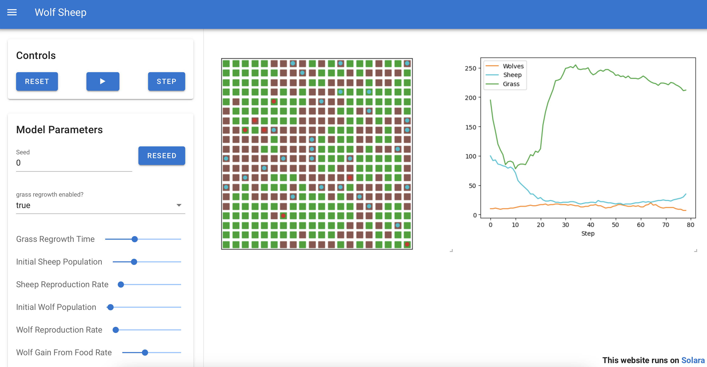

# Mesa: Agent-based modeling in Python

```{image} https://github.com/projectmesa/mesa/workflows/build/badge.svg
:target: https://github.com/projectmesa/mesa/actions
```

```{image} https://codecov.io/gh/projectmesa/mesa/branch/main/graph/badge.svg
:target: https://codecov.io/gh/projectmesa/mesa
```

```{image} https://img.shields.io/badge/code%20style-black-000000.svg
:target: https://github.com/psf/black
```

```{image} https://img.shields.io/matrix/project-mesa:matrix.org?label=chat&logo=Matrix
:target: https://matrix.to/#/#project-mesa:matrix.org
```

[Mesa] is an Apache2 licensed agent-based modeling (or ABM) framework in Python.

Mesa allows users to quickly create agent-based models using built-in core components (such as spatial grids and agent schedulers) or customized implementations; visualize them using a browser-based interface; and analyze their results using Python's data analysis tools. Its goal is to be the Python-based counterpart to NetLogo, Repast, or MASON.


*A visualisation of the Wolf Sheep model build with Mesa.*

## Features

- Built-in core modeling components
- Flexible agent and model management through AgentSet
- Browser-based Solara visualization
- Built-in tools for data collection and analysis
- Example model library

## Using Mesa
### Installation Options
To install our latest stable release, run:

```bash
pip install -U mesa
```
To also install our recommended dependencies:
```bash
pip install -U mesa[rec]
```

On a Mac, this command might cause an error stating `zsh: no matches found: mesa[all]`.
In that case, change the command to `pip install -U "mesa[rec]"`.


### Resources

For help getting started with Mesa, check out these resources:

- [Getting started] - Learn about Mesa's core concepts and components
- [Migration Guide] - Upgrade to Mesa 3.0
- [Mesa Examples] - Browse user-contributed models and implementations
- [Mesa Extensions] - Overview of mesa's Extensions
- [GitHub Discussions] - Ask questions and discuss Mesa
- [Matrix Chat Room] - Real-time chat with the Mesa community

### Development and Support

Mesa is an open source project and welcomes contributions:

- [GitHub Repository] - Access the source code
- [Issue Tracker] - Report bugs or suggest features
- [Contributors Guide] - Learn how to contribute

The original Mesa conference paper is [available here](http://conference.scipy.org.s3-website-us-east-1.amazonaws.com/proceedings/scipy2015/jacqueline_kazil.html).

```{toctree}
:hidden: true
:maxdepth: 7

Getting started <getting_started>
Examples <examples>
Migration guide <migration_guide>
API Documentation <apis/api_main>

```

# Indices and tables

- {ref}`genindex`
- {ref}`modindex`
- {ref}`search`

[contributors guide]: https://github.com/projectmesa/mesa/blob/main/CONTRIBUTING.md
[github repository]: https://github.com/projectmesa/mesa/
[github discussions]: https://github.com/projectmesa/mesa/discussions
[issue tracker]: https://github.com/projectmesa/mesa/issues
[matrix chat room]: https://matrix.to/#/#project-mesa:matrix.org
[mesa]: https://github.com/projectmesa/mesa/
[mesa overview]: overview
[mesa examples]: https://mesa.readthedocs.io/stable/examples.html
[mesa introductory tutorial]: tutorials/intro_tutorial
[mesa visualization tutorial]: tutorials/visualization_tutorial
[migration guide]: migration_guide
[Getting started]: getting_started
[Mesa Extensions]: mesa_extension.md
