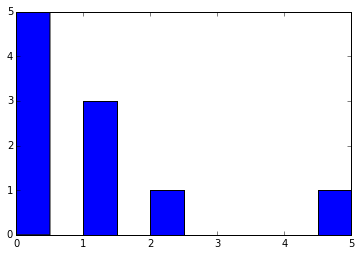
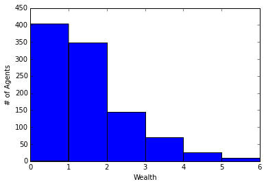
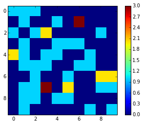
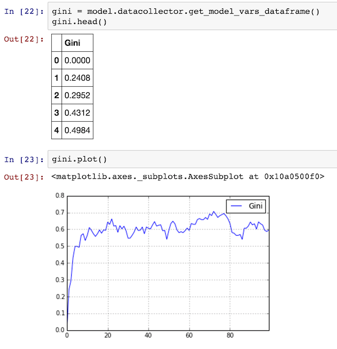
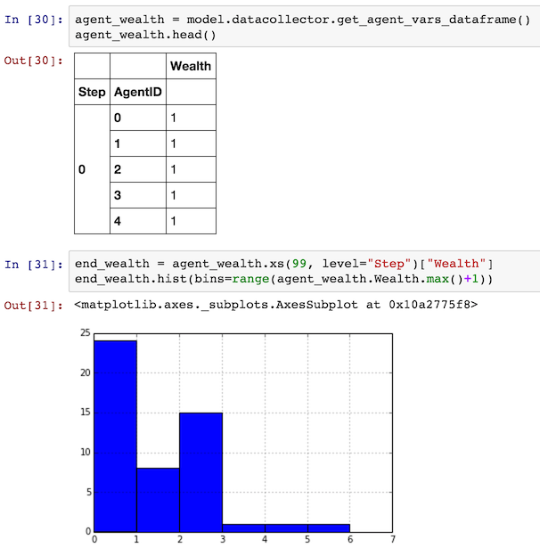
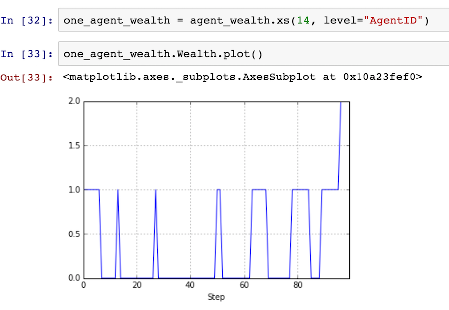
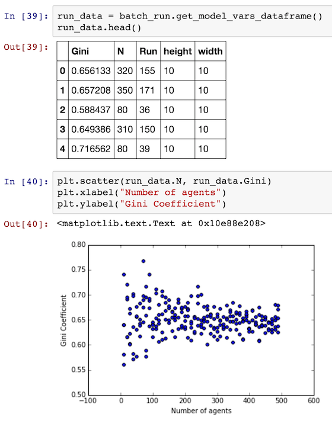

Introduction to Mesa - Tutorial
*********************************

`Mesa <https://github.com/projectmesa/mesa>`_ is a Python framework for `agent-based modeling <https://en.wikipedia.org/wiki/Agent-based_model>`_.
Getting started with Mesa is easy. In this tutorial, we will walk through creating a simple model and progressively add functionality which will illustrate Mesa's core features.

**Note:** *This tutorial is a work-in-progress. If you find any errors or bugs, or just find something unclear or confusing, `let us know <https://github.com/projectmesa/mesa/issues>`_!*

The base for this tutorial is a very simple model of agents exchanging money. Next, we add *space* to allow agents move. Then, we'll cover two of Mesa's analytic tools: the *data collector* and *batch runner*. After that, we'll add an *interactive visualization* which lets us watch the model as it runs. Finally, we go over how to write your own visualization module, for users who are comfortable with JavaScript.

You can also find all the code this tutorial describes in the **examples/Tutorial-Boltzmann_Wealth_Model** directory of the Mesa repository.

.. contents:: Tutorial Contents

Sample Model Description
------------------------

The tutorial model is a very simple simulated agent-based economy, drawn from econophysics and presenting a statistical mechanics approach to wealth distribution [Dragulescu2002]_. The rules of our tutorial model:

1. There are some number of agents.
2. All agents begin with 1 unit of money.
3. At every step of the model, an agent gives 1 unit of money (if they have it) to some other agent.

Despite its simplicity, this model yields results that are often unexpected to those not familiar with it. For our purposes, it also easily demonstrates Mesa's core features.

Let's get started.

Installation
------------

To start, install Mesa. We recommend doing this in a `virtual environment <https://virtualenvwrapper.readthedocs.org/en/stable/>`_, but make sure your environment is set up with Python 3. Mesa requires Python3 and does not work in Python 2 environments.

To install Mesa, simply:

.. code-block:: bash

    $ pip install mesa

When you do that, it will install Mesa itself, as well as any dependencies that aren't in your setup yet.

Building a sample model
------------------------

Once Mesa is installed, you can start building our model. You can write models in two different ways:

1. Write the code in its own file with your favorite text editor, or
2. Write the model interactively in `Jupyter Notebook <http://jupyter.org/>`_ cells.

Either way, it's good practice to put your model in its own folder -- especially if the project will end up consisting of multiple files (for example, Python files for the model and the visualization,  a Notebook for analysis, and a Readme with some documentation and discussion).

Begin by creating a folder, and either launch a Notebook or create a new Python source file.  We will use the name ``MoneyModel.py`` here.

Setting up the model
~~~~~~~~~~~~~~~~~~~~~

To begin writing the model code, we start with two core classes: one for the overall model, the other for the agents. The model class holds the model-level attributes, manages the agents, and generally handles the global level of our model. Each instantiation of the model class will be a specific model run. Each model will contain multiple agents, all of which are instantiations of the agent class. Both the model and agent classes are child classes of Mesa's generic ``Model`` and ``Agent`` classes.

Each agent has only one variable: how much wealth it currently has. (Each agent will also have a unique identifier (i.e., a name), stored in the ``unique_id`` variable. Giving each agent a unique id is a good practice when doing agent-based modeling.)

There is only one model-level parameter: how many agents the model contains. When a new model is started, we want it to populate itself with the given number of agents. We also set the model's ``running`` property to True; this should be set by default, then changed to False if the model reaches an end condition.

The beginning of both classes looks like this:

.. code-block:: python

    from mesa import Agent, Model

    class MoneyAgent(Agent):
        """An agent with fixed initial wealth."""
        def __init__(self, unique_id):
            self.unique_id = unique_id
            self.wealth = 1

    class MoneyModel(Model):
        """A model with some number of agents."""
        def __init__(self, N):
            self.running = True
            self.num_agents = N
            # Create agents
            for i in range(self.num_agents):
                a = MoneyAgent(i)

Adding the scheduler
~~~~~~~~~~~~~~~~~~~~~

Time in most agent-based models moves in steps, sometimes also called **ticks**. At each step of the model, one or more of the agents -- usually all of them -- are activated and take their own step, changing internally and/or interacting with one another or the environment.

The **scheduler** is a special model component which controls the order in which agents are activated. For example, all the agents may activate in the same order every step; their order might be shuffled; we may try to simulate all the agents acting at the same time; and more. Mesa offers a few different built-in scheduler classes, with a common interface. That makes it easy to change the activation regime a given model uses, and see whether it changes the model behavior. This may not seem important, but scheduling patterns can have an impact on your results [Comer2014]_.

For now, let's use one of the simplest ones: ``RandomActivation``, which activates all the agents once per step, in random order. Every agent is expected to have a ``step`` method, which takes a model object as its only argument -- this is the agent's action when it is activated. We add an agent to the schedule using the ``add`` method; when we call the schedule's ``step`` method, it shuffles the order of the agents, then activates them all, one at a time.

With that in mind, the model code with the scheduler added looks like this:

.. code-block:: python

    from mesa import Agent, Model
    from mesa.time import RandomActivation

    class MoneyAgent(Agent):
        """ An agent with fixed initial wealth."""
        def __init__(self, unique_id):
            self.unique_id = unique_id
            self.wealth = 1

        def step(self, model):
            # The agent's step will go here.
            pass

    class MoneyModel(Model):
        """A model with some number of agents."""
        def __init__(self, N):
            self.running = True
            self.num_agents = N
            self.schedule = RandomActivation(self)
            # Create agents
            for i in range(self.num_agents):
                a = MoneyAgent(i)
                self.schedule.add(a)

        def step(self):
            '''Advance the model by one step.'''
            self.schedule.step()

At this point, we have a model which runs -- it just doesn't do anything. You can see for yourself with a few easy lines. If you've been working in an interactive session, you can create a model object directly. Otherwise, you need to open an interactive session in the same directory as your source code file, and import the classes. For example, if your code is in ``MoneyModel.py``:

.. code-block::python

    from MoneyModel import MoneyModel

Then create the model object, and run it for one step:

.. code-block:: python

    empty_model = MoneyModel(10)
    empty_model.step()

**Exercise:** Try modifying the code above to have every agent print out its ``unique_id`` when it is activated. Run a few steps of the model to see how the agent activation order is shuffled each step.

Agent step
~~~~~~~~~~

Now we just need to have the agents do what we intend for them to do: check their wealth, and if they have the money, give one unit of it away to another random agent. Since we want to use randomness, don't forget to import Python's ``random`` library:

.. code-block:: python

    import random

To pick an agent at random, we need a list of all agents. Notice that there isn't such a list explicitly in the model. The scheduler, however, does have an internal list of all the agents it is scheduled to activate.

With that in mind, we rewrite the agent's ``step`` method, like this:

.. code-block:: python

    class MoneyAgent(Agent):
        # ...
        def step(self, model):
            if self.wealth == 0:
                return
            other_agent = random.choice(model.schedule.agents)
            other_agent.wealth += 1
            self.wealth -= 1

Running your first model
~~~~~~~~~~~~~~~~~~~~~~~~~

With that last piece in hand, it's time for the first rudimentary run of the model.

If you've written the code in its own file (``MoneyModel.py`` or a different name), launch an interpreter in the same directory as the file (either the plain Python command-line interpreter, or the IPython interpreter), or launch a Jupyter Notebook there. Then import the classes you created. (If you wrote the code in a Notebook, obviously this step isn't necessary).

.. code-block:: python

    from MoneyModel import *

Now let's create a model with 10 agents, and run it for 10 steps.

.. code-block:: python

    model = MoneyModel(10)
    for i in range(10):
        model.step()

Next, we need to get some data out of the model. Specifically, we want to see the distribution of the agent's wealth. We can get the wealth values with list comprehension, and then use matplotlib (or another graphics library) to visualize the data in a histogram.

.. code-block:: python

    # Put this import at the top of the file
    import matplotlib.pyplot as plt

    agent_wealth = [a.wealth for a in model.schedule.agents]
    plt.hist(agent_wealth)

If you are running from a text editor or IDE, you'll also need to add this line, to make the graph appear.

.. code-block:: python

    plt.show()

You'll probably see something like the distribution shown below. Yours will almost certainly look at least slightly different, since each run of the model is random, after all.

To get a better idea of how a model behaves, we can create multiple model runs and see the distribution that emerges from all of them. We can do this with a nested for loop:

.. code-block:: python

    all_wealth = []
    for j in range(100):
        # Run the model
        model = MoneyModel(10)
        for i in range(10):
            model.step()
        # Store the results
        for agent in model.schedule.agents:
            all_wealth.append(agent.wealth)

    plt.hist(all_wealth, bins=range(max(all_wealth)+1))

This runs 100 instantiations of the model, and runs each for 10 steps. (Notice that we set the histogram bins to be integers, since agents can only have whole numbers of wealth). This distribution looks a lot smoother. By running the model 100 times, we smooth out some of the 'noise' of randomness, and get to the model's overall expected behavior.

This outcome might be surprising. Despite the fact that all agents, on average, give and receive one unit of money every step, the model converges to a state where most agents have a small amount of money and a small number have a lot of money.

Adding space
~~~~~~~~~~~~~

Many ABMs have a spatial element, with agents moving around and interacting with nearby neighbors. Mesa currently supports two overall kinds of spaces: grid, and continuous. Grids are divided into cells, and agents can only be on a particular cell, like pieces on a chess board. Continuous space, in contrast, allows agents to have any arbitrary position. Both grids and continuous spaces are frequently `toroidalhttps://en.wikipedia.org/wiki/Toroidal_graph`_, meaning that the edges wrap around, with cells on the right edge connected to those on the left edge, and the top to the bottom. This prevents some cells having fewer neighbors than others, or agents being able to go off the edge of the environment.

Let's add a simple spatial element to our model by putting our agents on a grid and make them walk around at random. Instead of giving their unit of money to any random agent, they'll give it to an agent on the same cell.

Mesa has two main types of grids: ``SingleGrid`` and ``MultiGrid``. ``SingleGrid`` enforces at most one agent per cell; ``MultiGrid`` allows multiple agents to be in the same cell. Since we want agents to be able to share a cell, we use ``MultiGrid``.

.. code-block:: python

    from mesa.space import MultiGrid

We instantiate a grid with height and width parameters, and a boolean as to whether the grid is toroidal. Let's make width and height model parameters, in addition to the number of agents, and have the grid always be toroidal. We can place agents on a grid with the grid's ``place_agent`` method, which takes an agent and an (x, y) tuple of the coordinates to place the agent.

.. code-block:: python

    class MoneyModel(Model):
        """A model with some number of agents."""
        def __init__(self, N, width, height):
            self.running = True
            self.num_agents = N
            self.grid = MultiGrid(height, width, True)
            self.schedule = RandomActivation(self)
            # Create agents
            for i in range(self.num_agents):
                a = MoneyAgent(i)
                self.schedule.add(a)
                # Add the agent to a random grid cell
                x = random.randrange(self.grid.width)
                y = random.randrange(self.grid.height)
                self.grid.place_agent(a, (x, y))

Under the hood, each agent's position is stored in two ways: the agent is contained in the grid in the cell it is currently in, and the agent has a ``pos`` variable with an (x, y) coordinate tuple. The ``place_agent`` method adds the coordinate to the agent automatically.

Now we need to add to the agents' behaviors, letting them move around and only give money to other agents in the same cell.

First let's handle movement, and have the agents move to a neighboring cell. The grid object provides a ``move_agent`` method, which like you'd imagine, moves an agent to a given cell. That still leaves us to get the possible neighboring cells to move to. There are a couple ways to do this. One is to use the current coordinates, and loop over all coordinates +/- 1 away from it. For example:

.. code-block:: python

    neighbors = []
    x, y = self.pos
    for dx in [-1, 0, 1]:
        for dy in [-1, 0, 1]:
            neighbors.append((x+dx, y+dy))

But there's an even simpler way, using the grid's built-in ``get_neighborhood`` method, which returns all the neighbors of a given cell. This method can get two types of cell neighborhoods: Moore (including diagonals), and Von Neumann (only up/down/left/right). It also needs an argument as to whether to include the center cell itself as one of the neighbors.

With that in mind, the agent's ``move`` method looks like this:

.. code-block:: python

    class MoneyAgent(Agent):
        #...
        def move(self, model):
            possible_steps = model.grid.get_neighborhood(self.pos, moore=True, include_center=False)
            new_position = random.choice(possible_steps)
            model.grid.move_agent(self, new_position)

Next, we need to get all the other agents present in a cell, and give one of them some money. We can get the contents of one or more cells using the grid's ``get_cell_list_contents`` method, or by accessing a cell directly. The method currently requires a list of cells (TODO: someone should probably fix that...), even if we only care about one cell.

.. code-block:: python

    class MoneyAgent(Agent):
        #...
        def give_money(self, model):
            cellmates = model.grid.get_cell_list_contents([self.pos])
            if len(cellmates) > 1:
                other = random.choice(cellmates)
                other.wealth += 1
                self.wealth -= 1

And with those two methods, the agent's ``step`` method becomes:

.. code-block:: python

    class MoneyAgent(Agent):
        # ...
        def step(self, model):
            self.move(model)
            if self.wealth > 0:
                self.give_money(model)

Now, putting that all together should look like this:

.. code-block:: python

    class MoneyModel(Model):
        """A model with some number of agents."""
        def __init__(self, N, width, height):
            self.running = True
            self.num_agents = N
            self.grid = MultiGrid(height, width, True)
            self.schedule = RandomActivation(self)
            # Create agents
            for i in range(self.num_agents):
                a = MoneyAgent(i)
                self.schedule.add(a)
                # Add the agent to a random grid cell
                x = random.randrange(self.grid.width)
                y = random.randrange(self.grid.height)
                self.grid.place_agent(a, (x, y))

        def step(self):
            self.schedule.step()

    class MoneyAgent(Agent):
        """ An agent with fixed initial wealth."""
        def __init__(self, unique_id):
            self.unique_id = unique_id
            self.wealth = 1

        def move(self, model):
            possible_steps = model.grid.get_neighborhood(self.pos, moore=True, include_center=False)
            new_position = random.choice(possible_steps)
            model.grid.move_agent(self, new_position)

        def give_money(self, model):
            cellmates = model.grid.get_cell_list_contents([self.pos])
            if len(cellmates) > 1:
                other = random.choice(cellmates)
                other.wealth += 1
                self.wealth -= 1

        def step(self, model):
            self.move(model)
            if self.wealth > 0:
                self.give_money(model)

Let's create a model with 50 agents on a 10x10 grid, and run it for 20 steps.

.. code-block:: python

    model = MoneyModel(50, 10, 10)
    for i in range(20):
        model.step()

Now let's use matplotlib and numpy to visualize the number of agents residing in each cell. To do that, we create a numpy array of the same size as the grid, filled with zeros. Then we use the grid object's ``coord_iter()`` feature, which lets us loop over every cell in the grid, giving us each cell's coordinates and contents in turn.

.. code-block:: python

    # At the top of your file, import numpy
    import numpy as np

    agent_counts = np.zeros((model.grid.width, model.grid.height))
    for cell in model.grid.coord_iter():
        cell_content, x, y = cell
        agent_count = len(cell_content)
        agent_counts[y][x] = agent_count
    plt.imshow(agent_counts, interpolation='nearest')
    plt.colorbar()
    # If running from a text editor or IDE, uncomment this line.
    # plt.show()

Collecting Data
~~~~~~~~~~~~~~~~~

So far, at the end of every model run, we've had to go and write our own code to get the data out of the model. This has two problems: it isn't very efficient, and it only gives us end results. If we wanted to know the wealth of each agent at each step, we'd have to add that to the loop of executing steps, and figure out some way to store the data.

Since one of the main goals of agent-based modeling is generating data for analysis, Mesa provides a  class which can handle data collection and storage for us and make it easier to analyze.

The data collector stores three categories of data: model-level variables, agent-level variables, and tables (which are a catch-all for everything else). Model- and agent-level variables are added to the data collector along with a function for collecting them. Model-level collection functions take a model object as an input, while agent-level collection functions take an agent object as an input. Both then return a value computed from the model or each agent at their current state. When the data collector’s ``collect`` method is called, with a model object as its argument, it applies each model-level collection function to the model, and stores the results in a dictionary, associating the current value with the current step of the model. Similarly, the method applies each agent-level collection function to each agent currently in the schedule, associating the resulting value with the step of the model, and the agent’s ``unique_id``.

Let's add a DataCollector to the model, and collect two variables. At the agent level, we want to collect every agent's wealth at every step. At the model level, let's measure the model's `Gini Coefficient <https://en.wikipedia.org/wiki/Gini_coefficient>`_, a measure of wealth inequality.

.. code-block:: python

    from mesa.datacollection import DataCollector

    def compute_gini(model):
        agent_wealths = [agent.wealth for agent in model.schedule.agents]
        x = sorted(agent_wealths)
        N = model.num_agents
        B = sum( xi * (N-i) for i,xi in enumerate(x) ) / (N*sum(x))
        return (1 + (1/N) - 2*B)

    # ...
    class MoneyModel(Model):
        def __init__(self, N, width, height):
            # ...
            self.datacollector = DataCollector(model_reporters={"Gini": compute_gini},
                agent_reporters={"Wealth": lambda a: a.wealth})

        def step(self):
            self.datacollector.collect(self)
            self.schedule.step()

At every step of the model, the datacollector will collect and store the model-level current Gini coefficient, as well as each agent's wealth, associating each with the current step.

We run the model just as we did above. Now is when an interactive session, especially via a Notebook, comes in handy: the DataCollector can export the data it's collected as a pandas DataFrame, for easy interactive analysis.

.. code-block:: python

    model = MoneyModel(50, 10, 10)
    for i in range(100):
        model.step()

To get the series of Gini coefficients as a pandas DataFrame:

.. code-block:: python

    gini = model.datacollector.get_model_vars_dataframe()
    gini.plot()

Similarly, we can get the agent-wealth data:

.. code-block:: python

    agent_wealth = model.datacollector.get_agent_vars_dataframe()
    agent_wealth.head()

You'll see that the DataFrame's index is pairings of model step and agent ID. You can analyze it the way you would any other DataFrame. For example, to get a histogram of agent wealth at the model's end:

.. code-block:: python

    end_wealth = agent_wealth.xs(99, level="Step")["Wealth"]
    end_wealth.hist(bins=range(agent_wealth.Wealth.max()+1))

Or to plot the wealth of a given agent (in this example, agent 14):

.. code-block:: python

    one_agent_wealth = agent_wealth.xs(14, level="AgentID")
    one_agent_wealth.Wealth.plot()

Batch Run
~~~~~~~~~~~

Like we mentioned above, you usually won't run a model only once, but multiple times: with fixed parameters to find the overall distributions the model generates, and with varying parameters to analyze how they drive the model's outputs and behaviors. Instead of needing to write nested for-loops for each model, Mesa provides a BatchRunner class which automates it for you.

.. code-block:: python

    from mesa.batchrunner import BatchRunner

We instantiate a BatchRunner with a model class to run, and a dictionary mapping parameters to values for them to take. If any of these parameters are assigned more than one value, as a list or an iterator, the BatchRunner will know to run all the combinations of these values and the other ones. The BatchRunner also takes an argument for how many model instantiations to create and run at each combination of parameter values, and how many steps to run each instantiation for. Finally, like the DataCollector, it takes dictionaries of model- and agent-level reporters to collect. Unlike the DataCollector, it won't collect the data every step of the model, but only at the end of each run.

In the following example, we hold the height and width fixed, and vary the number of agents. We tell the BatchRunner to run 5 instantiations of the model with each number of agents, and to run each for 100 steps. We have it collect the final Gini coefficient value.

One more thing: batch runners need a way to tell if the model hits some end conditions before the maximum number of steps is reached. To do that, it uses the model's ``running`` variable. In this case, the model has no termination condition, so just add a line to the ``MoneyModel`` constructor:

.. code-block:: python

    self.running = True

Now, we can set up and run the BatchRunner:

.. code-block:: python

    parameters = {"height": 10, "width": 10, "N": range(10, 500, 10)}

    batch_run = BatchRunner(MoneyModel, parameters, iterations=5, max_steps=100,
               model_reporters={"Gini": compute_gini})
    batch_run.run_all()

Like the DataCollector, we can extract the data we collected as a DataFrame.

.. code-block:: python

    run_data = batch_run.get_model_vars_dataframe()
    run_data.head()
    plt.scatter(run_data.N, run_data.Gini)

Notice that each row is a model run, and gives us the parameter values associated with that run. We can use  this data to view a scatter-plot comparing the number of agents to the final Gini.

Adding visualization
---------------------------

So far, we've built a model, run it, and analyzed some output afterwards. However, one of the advantages of agent-based models is that we can often watch them run step by step, potentially spotting unexpected patterns, behaviors or bugs, or developing new intuitions, hypotheses, or insights. Other times, watching a model run can explain it to an unfamiliar audience better than static explanations. Like many ABM frameworks, Mesa allows you to create an interactive visualization of the model. In this section we'll walk through creating a visualization using built-in components, and (for advanced users) how to create a new visualization element.

First, a quick explanation of how Mesa's interactive visualization works. Visualization is done in a browser window, using JavaScript to draw the different things being visualized at each step of the model. To do this, Mesa launches a small web server, which runs the model, turns each step into a JSON object (essentially, structured plain text) and sends those steps to the browser.

A visualization is built up of a few different modules: for example, a module for drawing agents on a grid, and another one for drawing a chart of some variable. Each module has a Python part, which runs on the server and turns a model state into JSON data; and a JavaScript side, which takes that JSON data and draws it in the browser window. Mesa comes with a few modules built in, and let you add your own as well.

Grid Visualization
~~~~~~~~~~~~~~~~~~~

To start with, let's have a visualization where we can watch the agents moving around the grid.For this, you will need to put your model code in a separate Python source file; for example, ``MoneyModel.py``. Next, either in the same file or in a new one (e.g. ``MoneyModel_Viz.py``) import the server class and the Canvas Grid class (so-called because it uses HTML5 canvas to draw a grid). If you're in a new file, you'll also need to import the actual model object.

.. code-block:: python

    from mesa.visualization.modules import CanvasGrid
    from mesa.visualization.ModularVisualization import ModularServer

    from MoneyModel import MoneyModel # If MoneyModel.py is where your code is.

``CanvasGrid`` works by looping over every cell in a grid, and generating a portrayal for every agent it finds. A portrayal is a dictionary (which can easily be turned into a JSON object) which tells the JavaScript side how to draw it. The only thing we need to provide is a function which takes an agent, and returns a portrayal object. Here's the simplest one: it'll draw each agent as a red, filled circle which fills half of each cell.

.. code-block:: python

    def agent_portrayal(agent):
        portrayal = {"Shape": "circle",
                     "Color": "red",
                     "Filled": "true",
                     "Layer": 0,
                     "r": 0.5}
        return portrayal

In addition to the portrayal method, we instantiate a canvas grid with its width and height in cells, and in pixels. In this case, let's create a 10x10 grid, drawn in 500 x 500 pixels.

.. code-block:: python

    grid = CanvasGrid(agent_portrayal, 10, 10, 500, 500)

Now we create and launch the actual server. We do this with the following arguments:
    - The model class we're running and visualizing; in this case, ``MoneyModel``.
    - A list of module objects to include in the visualization; here, just ``[grid]``
    - The title of the model: "Money Model"
    - Any inputs or arguments for the model itself. In this case, 100 agents, and height and width of 10.

One we create the server, we set the port for it to listen on (you can treat this as just a piece of the URL you'll open in the browser). Finally, when you're ready to run the visualization, use the server's ``launch()`` method.

.. code-block:: python

    server = ModularServer(MoneyModel, [grid], "Money Model", 100, 10, 10)
    server.port = 8889
    server.launch()

The full code should now look like:

.. code-block:: python

    from MoneyModel import *
    from mesa.visualization.modules import CanvasGrid
    from mesa.visualization.ModularVisualization import ModularServer

    def agent_portrayal(agent):
        portrayal = {"Shape": "circle",
                     "Filled": "true",
                     "Layer": 0,
                     "Color": "red",
                     "r": 0.5}
        return portrayal

    grid = CanvasGrid(agent_portrayal, 10, 10, 500, 500)
    server = ModularServer(MoneyModel, [grid], "Money Model", 100, 10, 10)
    server.port = 8889
    server.launch()

Now run this file; this should launch the interactive visualization server. Open your web browser of choice, and enter `127.0.0.1:8889 <127.0.0.1:8889>`_.

You should see something like the figure below: the model title, an empty space where the grid will be, and a control panel off to the right.

.. image:: images/tutorial/viz_empty.png
   :width: 50%
   :scale: 100%
   :alt: Model-level variable collected
   :align: center

Click the 'reset' button on the control panel, and you should see the grid fill up with red circles, representing agents.

.. image:: images/tutorial/viz_redcircles.png
   :width: 50%
   :scale: 100%
   :alt: Model-level variable collected
   :align: center

Click 'step' to advance the model by one step, and the agents will move around. Click 'run' and the agents will keep moving around, at the rate set by the 'fps' (frames per second) slider at the top. Try moving it around and see how the speed of the model changes. Pressing 'pause' will (as you'd expect) pause the model; presing 'run' again will restart it. Finally, 'reset' will start a new instantiation of the model.

To stop the visualization server, go back to the terminal where you launched it, and press Control+c.

Changing the agents
~~~~~~~~~~~~~~~~~~~

In the visualization above, all we could see is the agents moving around -- but not how much money they had, or anything else of interest. Let's change it so that agents who are broke (wealth 0) are drawn in grey, smaller, and above agents who still have money.

To do this, we go back to our ``agent_portrayal`` code and add some code to change the portrayal based on the agent properties.

.. code-block:: python

    def agent_portrayal(agent):
        portrayal = {"Shape": "circle",
                     "Filled": "true",
                     "r": 0.5}

        if agent.wealth > 0:
            portrayal["Color"] = "red"
            portrayal["Layer"] = 0
        else:
            portrayal["Color"] = "grey"
            portrayal["Layer"] = 1
            portrayal["r"] = 0.2
        return portrayal

Now launch the server again, open or refresh your browser page, and hit 'reset'. Initially it looks the same, but advance the model and smaller grey circles start to appear. Note that since the zero-wealth agents have a higher layer number, they are drawn on top of the red agents.

.. image:: images/tutorial/viz_greycircles.png
   :width: 50%
   :scale: 100%
   :alt: Model-level variable collected
   :align: center

Adding a chart
~~~~~~~~~~~~~~~

Next, let's add another element to the visualization: a chart, tracking the model's Gini Coefficient. This is another built-in element that Mesa provides.

.. code-block:: python

    from mesa.visualization.modules import ChartModule

The basic chart pulls data from the model's DataCollector, and draws it as a line graph using the `Charts.js <http://www.chartjs.org/>`_ JavaScript libraries. We instantiate a chart element with a list of series for the chart to track. Each series is defined in a dictionary, and has a ``Label`` (which must match the name of a model-level variable collected by the DataCollector) and a ``Color`` name. We can also give the chart the name of the DataCollector object in the model.

Finally, we add the chart to the list of elements in the server. The elements are added to the visualization in the order they appear, so the chart will appear underneath the grid.

.. code-block:: python

    chart = ChartModule([{"Label": "Gini", "Color": "Black"}],
                                data_collector_name='datacollector')

    server = ModularServer(MoneyModel, [grid, chart], "Money Model", 100, 10, 10)

Launch the visualization and start a model run, and you'll see a line chart underneath the grid. Every step of the model, the line chart updates along with the grid. Reset the model, and the chart resets too.

.. image:: images/tutorial/viz_chart.png
   :width: 50%
   :scale: 100%
   :alt: Model-level variable collected
   :align: center

**Note:** You might notice that the chart line only starts after a couple of steps; this is due to a bug in Charts.js which will hopefully be fixed soon.

Building your own visualization component
-------------------------------------------

**Note:** This section is for users who have a basic familiarity with JavaScript. If that's not you, don't worry! (If you're an advanced JavaScript coder and find things that we've done wrong or inefficiently here, please `let us know <https://github.com/projectmesa/mesa/issues>`_!)

If the visualization elements provided by Mesa aren't enough for you, you can build your own and plug them into the model server.

First, you need to understand how the visualization works under the hood. Remember that each visualization module has two sides: a Python object that runs on the server and generates JSON data from the model state (the server side), and a JavaScript object that runs in the browser and turns the JSON into something it renders on the screen (the client side).

Obviously, the two sides of each visualization must be designed in tandem. They result in one Python class, and one JavaScript ``.js`` file. The path to the JavaScript file is a property of the Python class.

For this example, let's build a simple histogram visualization, which can count the number of agents with each value of wealth. We'll use the `Charts.js <http://www.chartjs.org/>`_ JavaScript library, which is already included with Mesa. If you go and look at its documentation, you'll see that it had no histogram functionality, which means we have to build our own out of a bar chart. We'll keep the histogram as simple as possible, giving it a fixed number of integer bins. If you were designing a more general histogram to add to the Mesa repository for everyone to use across different models, obviously you'd want something more general.

Client-Side Code
~~~~~~~~~~~~~~~~~

In general, the server- and client-side are written in tandem. However, if you're like me and more comfortable with Python than JavaScript, it makes sense to figure out how to get the JavaScript working first, and then write the Python to be compatible with that.

In the same directory as your model, create a new file called ``HistogramModule.js``. This will store the JavaScript code for the client side of the new module.

JavaScript classes can look alien to people coming from other languages -- specifically, they can look like functions. (The Mozilla `Introduction to Object-Oriented JavaScript <https://developer.mozilla.org/en-US/docs/Web/JavaScript/Introduction_to_Object-Oriented_JavaScript>`_ is a good starting point). In `HistogramModule.js`, start by creating the class itself:

.. code-block:: javascript

    var HistogramModule = function(bins, canvas_width, canvas_height) {
        // The actual code will go here.
    };

Note that our object is instantiated with three arguments: the number of integer bins, and the width and height (in pixels) the chart will take up in the visualization window.

When the visualization object is instantiated, the first thing it needs to do is prepare to draw on the current page. To do so, it adds a `canvas <https://developer.mozilla.org/en-US/docs/Web/API/Canvas_API>`_ tag to the page, using `JQuery <https://jquery.com/>`_ 's dollar-sign syntax (JQuery is already included with Mesa). It also gets the canvas's context, which is required for doing anything with it.

.. code-block:: javascript

    var HistogramModule = function(bins, canvas_width, canvas_height) {

        // Create the tag:
        var canvas_tag = "<canvas width='" + canvas_width + "' height='" + canvas_height + "' ";
        canvas_tag += "style='border:1px dotted'></canvas>";
        // Append it to body:
        var canvas = $(canvas_tag)[0];
        $("body").append(canvas);
        // Create the context and the drawing controller:
        var context = canvas.getContext("2d");
    };

Look at the Charts.js `bar chart documentation <http://www.chartjs.org/docs/#bar-chart-introduction>`_; you'll see some of the boilerplate needed to get a chart set up. Especially important is the `data` object, which includes the datasets, labels, and color options. In this case, we want just one dataset (we'll keep things simple and name it "Data"); it has `bins` for categories, and the value of each category starts out at zero. Finally, using these boilerplate objects and the canvas context we created, we can create the chart object.

.. code-block:: javascript

    var HistogramModule = function(bins, canvas_width, canvas_height) {
        // Create the elements

        // Create the tag:
        var canvas_tag = "<canvas width='" + canvas_width + "' height='" + canvas_height + "' ";
        canvas_tag += "style='border:1px dotted'></canvas>";
        // Append it to body:
        var canvas = $(canvas_tag)[0];
        $("body").append(canvas);
        // Create the context and the drawing controller:
        var context = canvas.getContext("2d");

        // Prep the chart properties and series:
        var datasets = [{
            label: "Data",
            fillColor: "rgba(151,187,205,0.5)",
            strokeColor: "rgba(151,187,205,0.8)",
            highlightFill: "rgba(151,187,205,0.75)",
            highlightStroke: "rgba(151,187,205,1)",
            data: []
        }];

        // Add a zero value for each bin
        for (var i in bins)
            datasets[0].data.push(0);

        var data = {
            labels: bins,
            datasets: datasets
        };

        var options = {
            scaleBeginsAtZero: true
        };

        // Create the chart object
        var chart = new Chart(context).Bar(data, options);

        // Now what?
    };

There are two methods every client-side visualization class must implement to be able to work: ``render(data)`` to render the incoming data, and ``reset()`` which is called to clear the visualization when the user hits the reset button and starts a new model run.

In this case, the easiest way to pass data to the histogram is as an array, one value for each bin. We can then just loop over the array and update the values in the chart's dataset.

There are a few ways to reset the chart, but the easiest is probably to destroy it and create a new chart object in its place.

With that in mind, we can add these two methods to the class:

.. code-block:: javascript

    var HistogramModule = function(bins, canvas_width, canvas_height) {

        // ...Everything from above...

        this.render = function(data) {
            for (var i in data)
                chart.datasets[0].bars[i].value = data[i];
            chart.update();
        };

        this.reset = function() {
            chart.destroy();
            chart = new Chart(context).Bar(data, options);
        };
};

Note the ``this.`` before the method names. This makes them public and ensures that they are accessible outside of the object itself. All the other variables inside the class are only accessible inside the object itself, but not outside of it.

Server-Side Code
~~~~~~~~~~~~~~~~~

Can we get back to Python code? Please? Yo.

Every JavaScript visualization element has an equal and opposite server-side Python element. The Python class needs to also have a ``render`` method, to get data out of the model object and into a JSON-ready format. It also needs to point towards the code where the relevant JavaScript lives, and add the JavaScript object to the model page.

In a Python file (either its own, or in the same file as your visualization code), import the ``VisualizationElement`` class we'll inherit from, and create the new visualization class.

.. code-block:: python

    from mesa.visualization.ModularVisualization import VisualizationElement

    class HistogramModule(VisualizationElement):

        package_includes = ["Chart.min.js"]
        local_includes = ["HistogramModule.js"]

        def __init__(self, bins, canvas_height, canvas_width):
            self.canvas_height = canvas_height
            self.canvas_width = canvas_width
            self.bins = [0]*bins
            new_element = "new HistogramModule({}, {}, {})"
            new_element = new_element.format(bins, canvas_width, canvas_height)
            self.js_code = "elements.push(" + new_element + ");"

There are a few things going on here. ``package_includes`` is a list of JavaScript files that are part of Mesa itself that the visualization element relies on. You can see the included files in `mesa/visualization/templates/ <https://github.com/projectmesa/mesa/tree/tutorial_update/mesa/visualization/templates>`_. Similarly, ``local_includes`` is a list of JavaScript files in the same directory as the class code itself. Note that both of these are class variables, not object variables -- they hold for all particular objects.

Next, look at the ``__init__`` method. It takes three arguments: the number of bins, and the width and height for the histogram. It then uses these values to populate the ``js_code`` property; this is code that the server will insert into the visualization page, which will run when the page loads. In this case, it creates a new HistogramModule (the class we created in JavaScript in the step above) with the desired bins, width and height; it then appends  (``push``es) this object to ``elements``, the list of visualization elements that the visualization page itself maintains.

Now, the last thing we need is the ``render`` method. If we were making a general-purpose visualization module we'd want this to be more general, but in this case we can hard-code it to our model.

.. code-block:: python

    import numpy as np

    class HistogramModule(VisualizationElement):

        # ... Everything from above...

        def render(self, model):
            wealth_vals = [agent.wealth for agent in model.schedule.agents]
            hist = np.histogram(wealth_vals, bins=self.bins)[0]
            return [int(x) for x in hist]

Every time the render method is called (with a model object as the argument) it uses numpy to generate counts of agents with each wealth value in the bins, and then returns a list of these values. Note that the ``render`` method doesn't return a JSON string -- just an object that can be turned into JSON, in this case a Python list (with Python integers as the values; the ``json`` library doesn't like dealing with numpy's integer type).

Now, you can create your new HistogramModule and add it to the server:

.. code-block:: python

    histogram = HistogramModule(list(range(10)), 200, 500)
    server = ModularServer(MoneyModel, [grid, histogram, chart], "Money Model", 100, 10, 10)
    server.launch()

Run this code, and you should see your brand-new histogram added to the visualization and updating along with the model!

.. image:: images/tutorial/viz_histogram.png
   :width: 50%
   :scale: 100%
   :alt: Model-level variable collected
   :align: center

If you've felt comfortable with this section, it might be instructive to read the code for the `ModularServer <https://github.com/projectmesa/mesa/blob/master/mesa/visualization/ModularVisualization.py#L259>`_ and the `modular_template <https://github.com/projectmesa/mesa/blob/master/mesa/visualization/templates/modular_template.html>`_ to get a better idea of how all the pieces fit together.

**Happy modeling!**

** THIS DOC IS IN PROGRESS **

.. _`virtual environment`: http://docs.python-guide.org/en/latest/dev/virtualenvs/

.. [Comer2014] Comer, Kenneth W. “Who Goes First? An Examination of the Impact of Activation on Outcome Behavior in AgentBased Models.” George Mason University, 2014. http://gradworks.umi.com/36/23/3623940.html.

.. [Dragulescu2002] Drăgulescu, Adrian A., and Victor M. Yakovenko. “Statistical Mechanics of Money, Income, and Wealth: A Short Survey.” arXiv Preprint Cond-mat/0211175, 2002. http://arxiv.org/abs/cond-mat/0211175.

