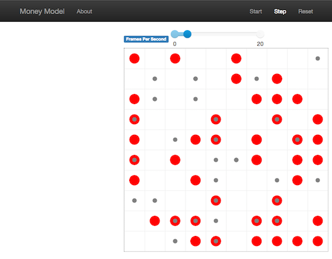
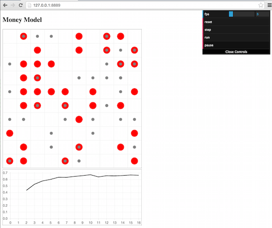
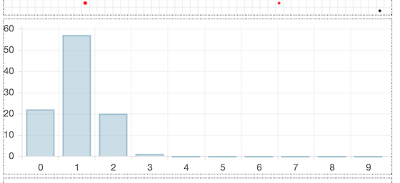

Advanced Tutorial
=================

Adding visualization
~~~~~~~~~~~~~~~~~~~~

So far, we've built a model, run it, and analyzed some output
afterwards. However, one of the advantages of agent-based models is that
we can often watch them run step by step, potentially spotting
unexpected patterns, behaviors or bugs, or developing new intuitions,
hypotheses, or insights. Other times, watching a model run can explain
it to an unfamiliar audience better than static explanations. Like many
ABM frameworks, Mesa allows you to create an interactive visualization
of the model. In this section we'll walk through creating a
visualization using built-in components, and (for advanced users) how to
create a new visualization element.

First, a quick explanation of how Mesa's interactive visualization
works. Visualization is done in a browser window, using JavaScript to
draw the different things being visualized at each step of the model. To
do this, Mesa launches a small web server, which runs the model, turns
each step into a JSON object (essentially, structured plain text) and
sends those steps to the browser.

A visualization is built up of a few different modules: for example, a
module for drawing agents on a grid, and another one for drawing a chart
of some variable. Each module has a Python part, which runs on the
server and turns a model state into JSON data; and a JavaScript side,
which takes that JSON data and draws it in the browser window. Mesa
comes with a few modules built in, and let you add your own as well.

Grid Visualization
^^^^^^^^^^^^^^^^^^

To start with, let's have a visualization where we can watch the agents
moving around the grid. For this, you will need to put your model code
in a separate Python source file; for example, ``MoneyModel.py``. Next,
either in the same file or in a new one (e.g. ``MoneyModel_Viz.py``)
import the server class and the Canvas Grid class (so-called because it
uses HTML5 canvas to draw a grid). If you're in a new file, you'll also
need to import the actual model object.

.. code:: python

    from mesa.visualization.modules import CanvasGrid
    from mesa.visualization.ModularVisualization import ModularServer

    # If MoneyModel.py is where your code is:
    # from MoneyModel import MoneyModel

``CanvasGrid`` works by looping over every cell in a grid, and
generating a portrayal for every agent it finds. A portrayal is a
dictionary (which can easily be turned into a JSON object) which tells
the JavaScript side how to draw it. The only thing we need to provide is
a function which takes an agent, and returns a portrayal object. Here's
the simplest one: it'll draw each agent as a red, filled circle which
fills half of each cell.

.. code:: python

    def agent_portrayal(agent):
        portrayal = {"Shape": "circle",
                     "Color": "red",
                     "Filled": "true",
                     "Layer": 0,
                     "r": 0.5}
        return portrayal

In addition to the portrayal method, we instantiate a canvas grid with
its width and height in cells, and in pixels. In this case, let's create
a 10x10 grid, drawn in 500 x 500 pixels.

.. code:: python

    grid = CanvasGrid(agent_portrayal, 10, 10, 500, 500)

Now we create and launch the actual server. We do this with the
following arguments:

-  The model class we're running and visualizing; in this case,
   ``MoneyModel``.
-  A list of module objects to include in the visualization; here, just
   ``[grid]``
-  The title of the model: "Money Model"
-  Any inputs or arguments for the model itself. In this case, 100
   agents, and height and width of 10.

Once we create the server, we set the port for it to listen on (you can
treat this as just a piece of the URL you'll open in the browser).
Finally, when you're ready to run the visualization, use the server's
``launch()`` method.

.. code:: python

    server = ModularServer(MoneyModel,
                           [grid],
                           "Money Model",
                           {"N":100, "width":10, "height":10})
    server.port = 8521 # The default
    server.launch()

The full code should now look like:

.. code:: python

    from MoneyModel import *
    from mesa.visualization.modules import CanvasGrid
    from mesa.visualization.ModularVisualization import ModularServer

    def agent_portrayal(agent):
        portrayal = {"Shape": "circle",
                     "Filled": "true",
                     "Layer": 0,
                     "Color": "red",
                     "r": 0.5}
        return portrayal

    grid = CanvasGrid(agent_portrayal, 10, 10, 500, 500)
    server = ModularServer(MoneyModel,
                           [grid],
                           "Money Model",
                           {"N":100, "width":10, "height":10})
    server.port = 8521 # The default
    server.launch()

Now run this file; this should launch the interactive visualization
server and open your web browser automatically. (If the browser doesn't
open automatically, try pointing it at http://127.0.0.1:8521 manually.
If this doesn't show you the visualization, something may have gone
wrong with the server launch.)

You should see something like the figure below: the model title, a grid
filled with red circles representing agents, and a set of buttons to the
right for running and resetting the model.

.. figure:: files/viz_redcircles.png
   :alt: Redcircles Visualization

   Redcircles Visualization

Click 'step' to advance the model by one step, and the agents will move
around. Click 'run' and the agents will keep moving around, at the rate
set by the 'fps' (frames per second) slider at the top. Try moving it
around and see how the speed of the model changes. Pressing 'pause' will
(as you'd expect) pause the model; presing 'run' again will restart it.
Finally, 'reset' will start a new instantiation of the model.

To stop the visualization server, go back to the terminal where you
launched it, and press Control+c.

Changing the agents
^^^^^^^^^^^^^^^^^^^

In the visualization above, all we could see is the agents moving around
-- but not how much money they had, or anything else of interest. Let's
change it so that agents who are broke (wealth 0) are drawn in grey,
smaller, and above agents who still have money.

To do this, we go back to our ``agent_portrayal`` code and add some code
to change the portrayal based on the agent properties.

.. code:: python

    def agent_portrayal(agent):
        portrayal = {"Shape": "circle",
                     "Filled": "true",
                     "r": 0.5}

        if agent.wealth > 0:
            portrayal["Color"] = "red"
            portrayal["Layer"] = 0
        else:
            portrayal["Color"] = "grey"
            portrayal["Layer"] = 1
            portrayal["r"] = 0.2
        return portrayal

Now launch the server again - this will open a new browser window
pointed at the updated visualization. Initially it looks the same, but
advance the model and smaller grey circles start to appear. Note that
since the zero-wealth agents have a higher layer number, they are drawn
on top of the red agents.

   Greycircles Visualization

Adding a chart
^^^^^^^^^^^^^^

Next, let's add another element to the visualization: a chart, tracking
the model's Gini Coefficient. This is another built-in element that Mesa
provides.

.. code:: python

    from mesa.visualization.modules import ChartModule

The basic chart pulls data from the model's DataCollector, and draws it
as a line graph using the `Charts.js <http://www.chartjs.org/>`__
JavaScript libraries. We instantiate a chart element with a list of
series for the chart to track. Each series is defined in a dictionary,
and has a ``Label`` (which must match the name of a model-level variable
collected by the DataCollector) and a ``Color`` name. We can also give
the chart the name of the DataCollector object in the model.

Finally, we add the chart to the list of elements in the server. The
elements are added to the visualization in the order they appear, so the
chart will appear underneath the grid.

.. code:: python

    chart = ChartModule([{"Label": "Gini",
                          "Color": "Black"}],
                        data_collector_name='datacollector')

    server = ModularServer(MoneyModel,
                           [grid, chart],
                           "Money Model",
                           {"N":100, "width":10, "height":10})

Launch the visualization and start a model run, and you'll see a line
chart underneath the grid. Every step of the model, the line chart
updates along with the grid. Reset the model, and the chart resets too.

   Chart Visualization

**Note:** You might notice that the chart line only starts after a
couple of steps; this is due to a bug in Charts.js which will hopefully
be fixed soon.

Building your own visualization component
~~~~~~~~~~~~~~~~~~~~~~~~~~~~~~~~~~~~~~~~~

**Note:** This section is for users who have a basic familiarity with
JavaScript. If that's not you, don't worry! (If you're an advanced
JavaScript coder and find things that we've done wrong or inefficiently,
please `let us know <https://github.com/projectmesa/mesa/issues>`__!)

If the visualization elements provided by Mesa aren't enough for you,
you can build your own and plug them into the model server.

First, you need to understand how the visualization works under the
hood. Remember that each visualization module has two sides: a Python
object that runs on the server and generates JSON data from the model
state (the server side), and a JavaScript object that runs in the
browser and turns the JSON into something it renders on the screen (the
client side).

Obviously, the two sides of each visualization must be designed in
tandem. They result in one Python class, and one JavaScript ``.js``
file. The path to the JavaScript file is a property of the Python class.

For this example, let's build a simple histogram visualization, which
can count the number of agents with each value of wealth. We'll use the
`Charts.js <http://www.chartjs.org/>`__ JavaScript library, which is
already included with Mesa. If you go and look at its documentation,
you'll see that it had no histogram functionality, which means we have
to build our own out of a bar chart. We'll keep the histogram as simple
as possible, giving it a fixed number of integer bins. If you were
designing a more general histogram to add to the Mesa repository for
everyone to use across different models, obviously you'd want something
more general.

Client-Side Code
^^^^^^^^^^^^^^^^

In general, the server- and client-side are written in tandem. However,
if you're like me and more comfortable with Python than JavaScript, it
makes sense to figure out how to get the JavaScript working first, and
then write the Python to be compatible with that.

In the same directory as your model, create a new file called
``HistogramModule.js``. This will store the JavaScript code for the
client side of the new module.

JavaScript classes can look alien to people coming from other languages
-- specifically, they can look like functions. (The Mozilla
`Introduction to Object-Oriented
JavaScript <https://developer.mozilla.org/en-US/docs/Web/JavaScript/Introduction_to_Object-Oriented_JavaScript>`__
is a good starting point). In ``HistogramModule.js``, start by creating
the class itself:

.. code:: javascript

    var HistogramModule = function(bins, canvas_width, canvas_height) {
        // The actual code will go here.
    };

Note that our object is instantiated with three arguments: the number of
integer bins, and the width and height (in pixels) the chart will take
up in the visualization window.

When the visualization object is instantiated, the first thing it needs
to do is prepare to draw on the current page. To do so, it adds a
`canvas <https://developer.mozilla.org/en-US/docs/Web/API/Canvas_API>`__
tag to the page, using `JQuery's <https://jquery.com/>`__ dollar-sign
syntax (JQuery is already included with Mesa). It also gets the canvas'
context, which is required for doing anything with it.

.. code:: javascript

    var HistogramModule = function(bins, canvas_width, canvas_height) {
        // Create the tag:
        var canvas_tag = "<canvas width='" + canvas_width + "' height='" + canvas_height + "' ";
        canvas_tag += "style='border:1px dotted'></canvas>";
        // Append it to #elements:
        var canvas = $(canvas_tag)[0];
        $("#elements").append(canvas);
        // Create the context and the drawing controller:
        var context = canvas.getContext("2d");
    };

Look at the Charts.js `bar chart
documentation <http://www.chartjs.org/docs/#bar-chart-introduction>`__.
You'll see some of the boilerplate needed to get a chart set up.
Especially important is the ``data`` object, which includes the
datasets, labels, and color options. In this case, we want just one
dataset (we'll keep things simple and name it "Data"); it has ``bins``
for categories, and the value of each category starts out at zero.
Finally, using these boilerplate objects and the canvas context we
created, we can create the chart object.

.. code:: javascript

    var HistogramModule = function(bins, canvas_width, canvas_height) {
        // Create the tag:
        var canvas_tag = "<canvas width='" + canvas_width + "' height='" + canvas_height + "' ";
        canvas_tag += "style='border:1px dotted'></canvas>";
        // Append it to #elements:
        var canvas = $(canvas_tag)[0];
        $("#elements").append(canvas);
        // Create the context and the drawing controller:
        var context = canvas.getContext("2d");

        // Prep the chart properties and series:
        var datasets = [{
            label: "Data",
            fillColor: "rgba(151,187,205,0.5)",
            strokeColor: "rgba(151,187,205,0.8)",
            highlightFill: "rgba(151,187,205,0.75)",
            highlightStroke: "rgba(151,187,205,1)",
            data: []
        }];

        // Add a zero value for each bin
        for (var i in bins)
            datasets[0].data.push(0);

        var data = {
            labels: bins,
            datasets: datasets
        };

        var options = {
            scaleBeginsAtZero: true
        };

        // Create the chart object
        var chart = new Chart(context, {type: 'bar', data: data, options: options});

        // Now what?
    };

There are two methods every client-side visualization class must
implement to be able to work: ``render(data)`` to render the incoming
data, and ``reset()`` which is called to clear the visualization when
the user hits the reset button and starts a new model run.

In this case, the easiest way to pass data to the histogram is as an
array, one value for each bin. We can then just loop over the array and
update the values in the chart's dataset.

There are a few ways to reset the chart, but the easiest is probably to
destroy it and create a new chart object in its place.

With that in mind, we can add these two methods to the class:

.. code:: javascript

    var HistogramModule = function(bins, canvas_width, canvas_height) {
        // ...Everything from above...
        this.render = function(data) {
            datasets[0].data = data;
            chart.update();
        };

        this.reset = function() {
            chart.destroy();
            chart = new Chart(context, {type: 'bar', data: data, options: options});
        };
    };

Note the ``this``. before the method names. This makes them public and
ensures that they are accessible outside of the object itself. All the
other variables inside the class are only accessible inside the object
itself, but not outside of it.

Server-Side Code
^^^^^^^^^^^^^^^^

Can we get back to Python code? Please?

Every JavaScript visualization element has an equal and opposite
server-side Python element. The Python class needs to also have a
``render`` method, to get data out of the model object and into a
JSON-ready format. It also needs to point towards the code where the
relevant JavaScript lives, and add the JavaScript object to the model
page.

In a Python file (either its own, or in the same file as your
visualization code), import the ``VisualizationElement`` class we'll
inherit from, and create the new visualization class.

.. code:: python

        from mesa.visualization.ModularVisualization import VisualizationElement

        class HistogramModule(VisualizationElement):
            package_includes = ["Chart.min.js"]
            local_includes = ["HistogramModule.js"]

            def __init__(self, bins, canvas_height, canvas_width):
                self.canvas_height = canvas_height
                self.canvas_width = canvas_width
                self.bins = bins
                new_element = "new HistogramModule({}, {}, {})"
                new_element = new_element.format(bins,
                                                 canvas_width,
                                                 canvas_height)
                self.js_code = "elements.push(" + new_element + ");"

There are a few things going on here. ``package_includes`` is a list of
JavaScript files that are part of Mesa itself that the visualization
element relies on. You can see the included files in
`mesa/visualization/templates/ <https://github.com/projectmesa/mesa/tree/tutorial_update/mesa/visualization/templates>`__.
Similarly, ``local_includes`` is a list of JavaScript files in the same
directory as the class code itself. Note that both of these are class
variables, not object variables -- they hold for all particular objects.

Next, look at the ``__init__`` method. It takes three arguments: the
number of bins, and the width and height for the histogram. It then uses
these values to populate the ``js_code`` property; this is code that the
server will insert into the visualization page, which will run when the
page loads. In this case, it creates a new HistogramModule (the class we
created in JavaScript in the step above) with the desired bins, width
and height; it then appends (``push``\ es) this object to ``elements``,
the list of visualization elements that the visualization page itself
maintains.

Now, the last thing we need is the ``render`` method. If we were making
a general-purpose visualization module we'd want this to be more
general, but in this case we can hard-code it to our model.

.. code:: python

    import numpy as np

    class HistogramModule(VisualizationElement):
        # ... Everything from above...

        def render(self, model):
            wealth_vals = [agent.wealth for agent in model.schedule.agents]
            hist = np.histogram(wealth_vals, bins=self.bins)[0]
            return [int(x) for x in hist]

Every time the render method is called (with a model object as the
argument) it uses numpy to generate counts of agents with each wealth
value in the bins, and then returns a list of these values. Note that
the ``render`` method doesn't return a JSON string -- just an object
that can be turned into JSON, in this case a Python list (with Python
integers as the values; the ``json`` library doesn't like dealing with
numpy's integer type).

Now, you can create your new HistogramModule and add it to the server:

.. code:: python

        histogram = HistogramModule(list(range(10)), 200, 500)
        server = ModularServer(MoneyModel,
                               [grid, histogram, chart],
                               "Money Model",
                               {"N":100, "width":10, "height":10})
        server.launch()

Run this code, and you should see your brand-new histogram added to the
visualization and updating along with the model!

   Histogram Visualization

If you've felt comfortable with this section, it might be instructive to
read the code for the
`ModularServer <https://github.com/projectmesa/mesa/blob/master/mesa/visualization/ModularVisualization.py#L259>`__
and the
`modular\_template <https://github.com/projectmesa/mesa/blob/master/mesa/visualization/templates/modular_template.html>`__
to get a better idea of how all the pieces fit together.

Happy Modeling!
~~~~~~~~~~~~~~~

This document is a work in progress. If you see any errors, exclusions
or have any problems please contact
`us <https://github.com/projectmesa/mesa/issues>`__.
