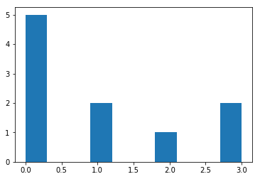
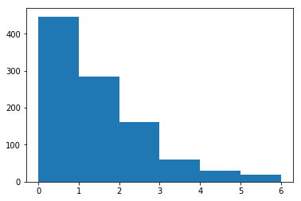
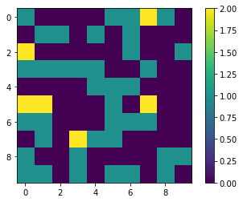
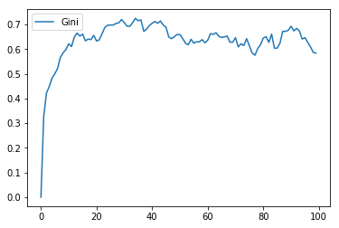
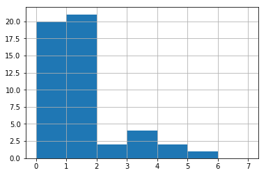
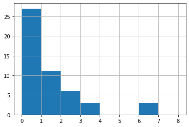

Introductory Tutorial
=====================

Tutorial Description
--------------------

`Mesa <https://github.com/projectmesa/mesa>`__ is a Python framework for
`agent-based
modeling <https://en.wikipedia.org/wiki/Agent-based_model>`__. Getting
started with Mesa is easy. In this tutorial, we will walk through
creating a simple model and progressively add functionality which will
illustrate Mesa's core features.

**Note:** This tutorial is a work-in-progress. If you find any errors or
bugs, or just find something unclear or confusing, `let us
know <https://github.com/projectmesa/mesa/issues>`__!

The base for this tutorial is a very simple model of agents exchanging
money. Next, we add *space* to allow agents move. Then, we'll cover two
of Mesa's analytic tools: the *data collector* and *batch runner*. After
that, we'll add an *interactive visualization* which lets us watch the
model as it runs. Finally, we go over how to write your own
visualization module, for users who are comfortable with JavaScript.

You can also find all the code this tutorial describes in the
`examples/boltzmann_wealth_model/ <https://github.com/projectmesa/mesa/tree/master/examples/boltzmann_wealth_model>`__ directory of the Mesa
repository.

Sample Model Description
------------------------

The tutorial model is a very simple simulated agent-based economy, drawn
from econophysics and presenting a statistical mechanics approach to
wealth distribution [Dragulescu2002]_. The rules of our tutorial model:

1. There are some number of agents.
2. All agents begin with 1 unit of money.
3. At every step of the model, an agent gives 1 unit of money (if they
   have it) to some other agent.

Despite its simplicity, this model yields results that are often
unexpected to those not familiar with it. For our purposes, it also
easily demonstrates Mesa's core features.

Let's get started.

Installation
~~~~~~~~~~~~

To start, install Mesa. We recommend using a `pipenv <https://pipenv.readthedocs.io/en/latest/>`_,
which combines the `virtual
environment <https://virtualenvwrapper.readthedocs.org/en/stable/>`_
along with the `dotenv <https://github.com/theskumar/python-dotenv>`_ projects
simplifying your experience, but make sure your environment is set up with Python 3.
Mesa requires Python3 and does not work in Python 2 environments.

To install Mesa, with pipenv run:

.. code:: bash

        $ pipenv install mesa

When you do that, it will install Mesa itself, setup an isolated virtual environment
as well as any dependencies that aren't in your setup yet.

Additional dependencies required by this tutorial can be found in the
`examples/boltzmann_wealth_model/requirements.txt <https://github.com/projectmesa/mesa/blob/master/examples/boltzmann_wealth_model/requirements.txt>`_ file,
which can be installed by running:

.. code:: bash

        $ pip install -r requirements.txt

Or you can add them to your pipenv to keep them in your virtual environment long term.

To access the virtual environment run

.. code:: bash

        $ pipenv shell

And then run any desired commands

Building a sample model
-----------------------

Once Mesa is installed, you can start building our model. You can write
models in two different ways:

1. Write the code in its own file with your favorite text editor, or
2. Write the model interactively in `Jupyter
   Notebook <http://jupyter.org/>`__ cells.

Either way, it's good practice to put your model in its own folder --
especially if the project will end up consisting of multiple files (for
example, Python files for the model and the visualization, a Notebook
for analysis, and a Readme with some documentation and discussion).

Begin by creating a folder, and either launch a Notebook or create a new
Python source file. We will use the name ``MoneyModel.py`` here.

Setting up the model
~~~~~~~~~~~~~~~~~~~~

To begin writing the model code, we start with two core classes: one for
the overall model, the other for the agents. The model class holds the
model-level attributes, manages the agents, and generally handles the
global level of our model. Each instantiation of the model class will be
a specific model run. Each model will contain multiple agents, all of
which are instantiations of the agent class. Both the model and agent
classes are child classes of Mesa's generic ``Model`` and ``Agent``
classes.

Each agent has only one variable: how much wealth it currently has.
(Each agent will also have a unique identifier (i.e., a name), stored in
the ``unique_id`` variable. Giving each agent a unique id is a good
practice when doing agent-based modeling.)

There is only one model-level parameter: how many agents the model
contains. When a new model is started, we want it to populate itself
with the given number of agents.

The beginning of both classes looks like this:

.. code:: python

    from mesa import Agent, Model

    class MoneyAgent(Agent):
        """An agent with fixed initial wealth."""
        def __init__(self, unique_id, model):
            super().__init__(unique_id, model)
            self.wealth = 1

    class MoneyModel(Model):
        """A model with some number of agents."""
        def __init__(self, N):
            self.num_agents = N
            # Create agents
            for i in range(self.num_agents):
                a = MoneyAgent(i, self)

Adding the scheduler
~~~~~~~~~~~~~~~~~~~~

Time in most agent-based models moves in steps, sometimes also called
**ticks**. At each step of the model, one or more of the agents --
usually all of them -- are activated and take their own step, changing
internally and/or interacting with one another or the environment.

The **scheduler** is a special model component which controls the order
in which agents are activated. For example, all the agents may activate
in the same order every step; their order might be shuffled; we may try
to simulate all the agents acting at the same time; and more. Mesa
offers a few different built-in scheduler classes, with a common
interface. That makes it easy to change the activation regime a given
model uses, and see whether it changes the model behavior. This may not
seem important, but scheduling patterns can have an impact on your
results [Comer2014]_.

For now, let's use one of the simplest ones: ``RandomActivation``, which
activates all the agents once per step, in random order. Every agent is
expected to have a ``step`` method, which takes a model object as its
only argument -- this is the agent's action when it is activated. We add
an agent to the schedule using the ``add`` method; when we call the
schedule's ``step`` method, it shuffles the order of the agents, then
activates them all, one at a time.

With that in mind, the model code with the scheduler added looks like
this:

.. code:: python

    from mesa import Agent, Model
    from mesa.time import RandomActivation

    class MoneyAgent(Agent):
        """ An agent with fixed initial wealth."""
        def __init__(self, unique_id, model):
            super().__init__(unique_id, model)
            self.wealth = 1

        def step(self):
            # The agent's step will go here.
            pass

    class MoneyModel(Model):
        """A model with some number of agents."""
        def __init__(self, N):
            self.num_agents = N
            self.schedule = RandomActivation(self)
            # Create agents
            for i in range(self.num_agents):
                a = MoneyAgent(i, self)
                self.schedule.add(a)

        def step(self):
            '''Advance the model by one step.'''
            self.schedule.step()

At this point, we have a model which runs -- it just doesn't do
anything. You can see for yourself with a few easy lines. If you've been
working in an interactive session, you can create a model object
directly. Otherwise, you need to open an interactive session in the same
directory as your source code file, and import the classes. For example,
if your code is in ``MoneyModel.py``:

.. code:: python

    from MoneyModel import MoneyModel

Then create the model object, and run it for one step:

.. code:: python

    empty_model = MoneyModel(10)
    empty_model.step()

Exercise
^^^^^^^^

Try modifying the code above to have every agent print out its
``unique_id`` when it is activated. Run a few steps of the model to see
how the agent activation order is shuffled each step.

Agent Step
~~~~~~~~~~

Now we just need to have the agents do what we intend for them to do:
check their wealth, and if they have the money, give one unit of it away
to another random agent. To allow the agent to choose another agent at
random, we use the ``model.random`` random-number generator. This works
just like Python's ``random`` module, but with a fixed seed set when the
model is instantiated, that can be used to replicate a specific model
run later.

To pick an agent at random, we need a list of all agents. Notice that
there isn't such a list explicitly in the model. The scheduler, however,
does have an internal list of all the agents it is scheduled to
activate.

With that in mind, we rewrite the agent's ``step`` method, like this:

.. code:: python

    class MoneyAgent(Agent):
        """ An agent with fixed initial wealth."""
        def __init__(self, unique_id, model):
            super().__init__(unique_id, model)
            self.wealth = 1

        def step(self):
            if self.wealth == 0:
                return
            other_agent = self.random.choice(self.model.schedule.agents)
            other_agent.wealth += 1
            self.wealth -= 1

Running your first model
~~~~~~~~~~~~~~~~~~~~~~~~

With that last piece in hand, it's time for the first rudimentary run of
the model.

If you've written the code in its own file (``MoneyModel.py`` or a
different name), launch an interpreter in the same directory as the file
(either the plain Python command-line interpreter, or the IPython
interpreter), or launch a Jupyter Notebook there. Then import the
classes you created. (If you wrote the code in a Notebook, obviously
this step isn't necessary).

.. code:: python

    from MoneyModel import *

Now let's create a model with 10 agents, and run it for 10 steps.

.. code:: python

    model = MoneyModel(10)
    for i in range(10):
        model.step()

Next, we need to get some data out of the model. Specifically, we want
to see the distribution of the agent's wealth. We can get the wealth
values with list comprehension, and then use matplotlib (or another
graphics library) to visualize the data in a histogram.

.. code:: python

    # For a jupyter notebook add the following line:
    %matplotlib inline

    # The below is needed for both notebooks and scripts
    import matplotlib.pyplot as plt

    agent_wealth = [a.wealth for a in model.schedule.agents]
    plt.hist(agent_wealth)

.. parsed-literal::

    (array([5., 0., 0., 2., 0., 0., 1., 0., 0., 2.]),
     array([0. , 0.3, 0.6, 0.9, 1.2, 1.5, 1.8, 2.1, 2.4, 2.7, 3. ]),
     <a list of 10 Patch objects>)

If you are running from a text editor or IDE, you'll also need to add
this line, to make the graph appear.

.. code:: python

    plt.show()

You'll probably see something like the distribution shown below. Yours
will almost certainly look at least slightly different, since each run
of the model is random, after all.

To get a better idea of how a model behaves, we can create multiple
model runs and see the distribution that emerges from all of them. We
can do this with a nested for loop:

.. code:: python

    all_wealth = []
    for j in range(100):
        # Run the model
        model = MoneyModel(10)
        for i in range(10):
            model.step()

        # Store the results
        for agent in model.schedule.agents:
            all_wealth.append(agent.wealth)

    plt.hist(all_wealth, bins=range(max(all_wealth)+1))

.. parsed-literal::

    (array([447., 284., 162.,  59.,  29.,  19.]),
     array([0, 1, 2, 3, 4, 5, 6]),
     <a list of 6 Patch objects>)

This runs 100 instantiations of the model, and runs each for 10 steps.
(Notice that we set the histogram bins to be integers, since agents can
only have whole numbers of wealth). This distribution looks a lot
smoother. By running the model 100 times, we smooth out some of the
'noise' of randomness, and get to the model's overall expected behavior.

This outcome might be surprising. Despite the fact that all agents, on
average, give and receive one unit of money every step, the model
converges to a state where most agents have a small amount of money and
a small number have a lot of money.

Adding space
~~~~~~~~~~~~

Many ABMs have a spatial element, with agents moving around and
interacting with nearby neighbors. Mesa currently supports two overall
kinds of spaces: grid, and continuous. Grids are divided into cells, and
agents can only be on a particular cell, like pieces on a chess board.
Continuous space, in contrast, allows agents to have any arbitrary
position. Both grids and continuous spaces are frequently
`toroidal <https://en.wikipedia.org/wiki/Toroidal_graph>`__, meaning
that the edges wrap around, with cells on the right edge connected to
those on the left edge, and the top to the bottom. This prevents some
cells having fewer neighbors than others, or agents being able to go off
the edge of the environment.

Let's add a simple spatial element to our model by putting our agents on
a grid and make them walk around at random. Instead of giving their unit
of money to any random agent, they'll give it to an agent on the same
cell.

Mesa has two main types of grids: ``SingleGrid`` and ``MultiGrid``.
``SingleGrid`` enforces at most one agent per cell; ``MultiGrid`` allows
multiple agents to be in the same cell. Since we want agents to be able
to share a cell, we use ``MultiGrid``.

.. code:: python

    from mesa.space import MultiGrid

We instantiate a grid with width and height parameters, and a boolean as
to whether the grid is toroidal. Let's make width and height model
parameters, in addition to the number of agents, and have the grid
always be toroidal. We can place agents on a grid with the grid's
``place_agent`` method, which takes an agent and an (x, y) tuple of the
coordinates to place the agent.

.. code:: python

    class MoneyModel(Model):
        """A model with some number of agents."""
        def __init__(self, N, width, height):
            self.num_agents = N
            self.grid = MultiGrid(width, height, True)
            self.schedule = RandomActivation(self)

            # Create agents
            for i in range(self.num_agents):
                a = MoneyAgent(i, self)
                self.schedule.add(a)

                # Add the agent to a random grid cell
                x = self.random.randrange(self.grid.width)
                y = self.random.randrange(self.grid.height)
                self.grid.place_agent(a, (x, y))

Under the hood, each agent's position is stored in two ways: the agent
is contained in the grid in the cell it is currently in, and the agent
has a ``pos`` variable with an (x, y) coordinate tuple. The
``place_agent`` method adds the coordinate to the agent automatically.

Now we need to add to the agents' behaviors, letting them move around
and only give money to other agents in the same cell.

First let's handle movement, and have the agents move to a neighboring
cell. The grid object provides a ``move_agent`` method, which like you'd
imagine, moves an agent to a given cell. That still leaves us to get the
possible neighboring cells to move to. There are a couple ways to do
this. One is to use the current coordinates, and loop over all
coordinates +/- 1 away from it. For example:

.. code:: python

    neighbors = []
    x, y = self.pos
    for dx in [-1, 0, 1]:
        for dy in [-1, 0, 1]:
            neighbors.append((x+dx, y+dy))

But there's an even simpler way, using the grid's built-in
``get_neighborhood`` method, which returns all the neighbors of a given
cell. This method can get two types of cell neighborhoods: Moore
(including diagonals), and Von Neumann (only up/down/left/right). It
also needs an argument as to whether to include the center cell itself
as one of the neighbors.

With that in mind, the agent's ``move`` method looks like this:

.. code:: python

    class MoneyAgent(Agent):
       #...
        def move(self):
            possible_steps = self.model.grid.get_neighborhood(
                self.pos,
                moore=True,
                include_center=False
            )
            new_position = self.random.choice(possible_steps)
            self.model.grid.move_agent(self, new_position)

Next, we need to get all the other agents present in a cell, and give
one of them some money. We can get the contents of one or more cells
using the grid's ``get_cell_list_contents`` method, or by accessing a
cell directly. The method accepts a list of cell coordinate tuples, or a
single tuple if we only care about one cell.

.. code:: python

    class MoneyAgent(Agent):
        #...
        def give_money(self):
            cellmates = self.model.grid.get_cell_list_contents([self.pos])
            if len(cellmates) > 1:
                other = self.random.choice(cellmates)
                other.wealth += 1
                self.wealth -= 1

And with those two methods, the agent's ``step`` method becomes:

.. code:: python

    class MoneyAgent(Agent):
        # ...
        def step(self):
            self.move()
            if self.wealth > 0:
                self.give_money()

Now, putting that all together should look like this:

.. code:: python

    class MoneyModel(Model):
        """A model with some number of agents."""
        def __init__(self, N, width, height):
            self.num_agents = N
            self.grid = MultiGrid(width, height, True)
            self.schedule = RandomActivation(self)
            # Create agents
            for i in range(self.num_agents):
                a = MoneyAgent(i, self)
                self.schedule.add(a)
                # Add the agent to a random grid cell
                x = self.random.randrange(self.grid.width)
                y = self.random.randrange(self.grid.height)
                self.grid.place_agent(a, (x, y))

        def step(self):
            self.schedule.step()

    class MoneyAgent(Agent):
        """ An agent with fixed initial wealth."""
        def __init__(self, unique_id, model):
            super().__init__(unique_id, model)
            self.wealth = 1

        def move(self):
            possible_steps = self.model.grid.get_neighborhood(
                self.pos,
                moore=True,
                include_center=False)
            new_position = self.random.choice(possible_steps)
            self.model.grid.move_agent(self, new_position)

        def give_money(self):
            cellmates = self.model.grid.get_cell_list_contents([self.pos])
            if len(cellmates) > 1:
                other = self.random.choice(cellmates)
                other.wealth += 1
                self.wealth -= 1

        def step(self):
            self.move()
            if self.wealth > 0:
                self.give_money()

Let's create a model with 50 agents on a 10x10 grid, and run it for 20
steps.

.. code:: python

    model = MoneyModel(50, 10, 10)
    for i in range(20):
        model.step()

Now let's use matplotlib and numpy to visualize the number of agents
residing in each cell. To do that, we create a numpy array of the same
size as the grid, filled with zeros. Then we use the grid object's
``coord_iter()`` feature, which lets us loop over every cell in the
grid, giving us each cell's coordinates and contents in turn.

.. code:: python

    import numpy as np

    agent_counts = np.zeros((model.grid.width, model.grid.height))
    for cell in model.grid.coord_iter():
        cell_content, x, y = cell
        agent_count = len(cell_content)
        agent_counts[x][y] = agent_count
    plt.imshow(agent_counts, interpolation='nearest')
    plt.colorbar()

    # If running from a text editor or IDE, remember you'll need the following:
    # plt.show()

.. parsed-literal::

    <matplotlib.colorbar.Colorbar at 0x2612cbb19e8>

Collecting Data
~~~~~~~~~~~~~~~

So far, at the end of every model run, we've had to go and write our own
code to get the data out of the model. This has two problems: it isn't
very efficient, and it only gives us end results. If we wanted to know
the wealth of each agent at each step, we'd have to add that to the loop
of executing steps, and figure out some way to store the data.

Since one of the main goals of agent-based modeling is generating data
for analysis, Mesa provides a class which can handle data collection and
storage for us and make it easier to analyze.

The data collector stores three categories of data: model-level
variables, agent-level variables, and tables (which are a catch-all for
everything else). Model- and agent-level variables are added to the data
collector along with a function for collecting them. Model-level
collection functions take a model object as an input, while agent-level
collection functions take an agent object as an input. Both then return
a value computed from the model or each agent at their current state.
When the data collector’s ``collect`` method is called, with a model
object as its argument, it applies each model-level collection function
to the model, and stores the results in a dictionary, associating the
current value with the current step of the model. Similarly, the method
applies each agent-level collection function to each agent currently in
the schedule, associating the resulting value with the step of the
model, and the agent’s ``unique_id``.

Let's add a DataCollector to the model, and collect two variables. At
the agent level, we want to collect every agent's wealth at every step.
At the model level, let's measure the model's `Gini
Coefficient <https://en.wikipedia.org/wiki/Gini_coefficient>`__, a
measure of wealth inequality.

.. code:: python

    from mesa.datacollection import DataCollector

    def compute_gini(model):
        agent_wealths = [agent.wealth for agent in model.schedule.agents]
        x = sorted(agent_wealths)
        N = model.num_agents
        B = sum( xi * (N-i) for i,xi in enumerate(x) ) / (N*sum(x))
        return (1 + (1/N) - 2*B)

    class MoneyAgent(Agent):
        """ An agent with fixed initial wealth."""
        def __init__(self, unique_id, model):
            super().__init__(unique_id, model)
            self.wealth = 1

        def move(self):
            possible_steps = self.model.grid.get_neighborhood(
                self.pos,
                moore=True,
                include_center=False)
            new_position = self.random.choice(possible_steps)
            self.model.grid.move_agent(self, new_position)

        def give_money(self):
            cellmates = self.model.grid.get_cell_list_contents([self.pos])
            if len(cellmates) > 1:
                other = self.random.choice(cellmates)
                other.wealth += 1
                self.wealth -= 1

        def step(self):
            self.move()
            if self.wealth > 0:
                self.give_money()

    class MoneyModel(Model):
        """A model with some number of agents."""
        def __init__(self, N, width, height):
            self.num_agents = N
            self.grid = MultiGrid(width, height, True)
            self.schedule = RandomActivation(self)

            # Create agents
            for i in range(self.num_agents):
                a = MoneyAgent(i, self)
                self.schedule.add(a)
                # Add the agent to a random grid cell
                x = self.random.randrange(self.grid.width)
                y = self.random.randrange(self.grid.height)
                self.grid.place_agent(a, (x, y))

            self.datacollector = DataCollector(
                model_reporters={"Gini": compute_gini},  # `compute_gini` defined above
                agent_reporters={"Wealth": "wealth"})

        def step(self):
            self.datacollector.collect(self)
            self.schedule.step()

At every step of the model, the datacollector will collect and store the
model-level current Gini coefficient, as well as each agent's wealth,
associating each with the current step.

We run the model just as we did above. Now is when an interactive
session, especially via a Notebook, comes in handy: the DataCollector
can export the data it's collected as a pandas DataFrame, for easy
interactive analysis.

.. code:: python

    model = MoneyModel(50, 10, 10)
    for i in range(100):
        model.step()

To get the series of Gini coefficients as a pandas DataFrame:

.. code:: python

    gini = model.datacollector.get_model_vars_dataframe()
    gini.plot()

.. parsed-literal::

    <matplotlib.axes._subplots.AxesSubplot at 0x2612cbcf048>

Similarly, we can get the agent-wealth data:

.. code:: python

    agent_wealth = model.datacollector.get_agent_vars_dataframe()
    agent_wealth.head()

.. raw:: html

    

    
    <table border="1" class="dataframe">
      <thead>
        <tr style="text-align: right;">
          <th></th>
          <th></th>
          <th>Wealth</th>
        </tr>
        <tr>
          <th>Step</th>
          <th>AgentID</th>
          <th></th>
        </tr>
      </thead>
      <tbody>
        <tr>
          <th rowspan="5" valign="top">0</th>
          <th>0</th>
          <td>1</td>
        </tr>
        <tr>
          <th>1</th>
          <td>1</td>
        </tr>
        <tr>
          <th>2</th>
          <td>1</td>
        </tr>
        <tr>
          <th>3</th>
          <td>1</td>
        </tr>
        <tr>
          <th>4</th>
          <td>1</td>
        </tr>
      </tbody>
    </table>
    

You'll see that the DataFrame's index is pairings of model step and
agent ID. You can analyze it the way you would any other DataFrame. For
example, to get a histogram of agent wealth at the model's end:

.. code:: python

    end_wealth = agent_wealth.xs(99, level="Step")["Wealth"]
    end_wealth.hist(bins=range(agent_wealth.Wealth.max()+1))

.. parsed-literal::

    <matplotlib.axes._subplots.AxesSubplot at 0x2612d972470>

Or to plot the wealth of a given agent (in this example, agent 14):

.. code:: python

    one_agent_wealth = agent_wealth.xs(14, level="AgentID")
    one_agent_wealth.Wealth.plot()

.. parsed-literal::

    <matplotlib.axes._subplots.AxesSubplot at 0x2612dacec50>

Batch Run
~~~~~~~~~

Like we mentioned above, you usually won't run a model only once, but
multiple times, with fixed parameters to find the overall distributions
the model generates, and with varying parameters to analyze how they
drive the model's outputs and behaviors. Instead of needing to write
nested for-loops for each model, Mesa provides a BatchRunner class which
automates it for you.

.. code:: python

    from mesa.batchrunner import BatchRunner

The BatchRunner also requires an additional variable running for the
MoneyModel class. This variable enables conditional shut off of the
model once a condition is met. In this example it will be set as True
indefinitely.

.. code:: python

    class MoneyModel(Model):
        """A model with some number of agents."""
        def __init__(self, N, width, height):
            self.num_agents = N
            self.grid = MultiGrid(width, height, True)
            self.schedule = RandomActivation(self)
            self.running = True

            # Create agents
            for i in range(self.num_agents):
                a = MoneyAgent(i, self)
                self.schedule.add(a)
                # Add the agent to a random grid cell
                x = self.random.randrange(self.grid.width)
                y = self.random.randrange(self.grid.height)
                self.grid.place_agent(a, (x, y))

            self.datacollector = DataCollector(
                model_reporters={"Gini": compute_gini},
                agent_reporters={"Wealth": "wealth"}
            )

        def step(self):
            self.datacollector.collect(self)
            self.schedule.step()

We instantiate a BatchRunner with a model class to run, and two
dictionaries: one of the fixed parameters (mapping model arguments to
values) and one of varying parameters (mapping each parameter name to a
sequence of values for it to take). The BatchRunner also takes an
argument for how many model instantiations to create and run at each
combination of parameter values, and how many steps to run each
instantiation for. Finally, like the DataCollector, it takes
dictionaries of model- and agent-level reporters to collect. Unlike the
DataCollector, it won't collect the data every step of the model, but
only at the end of each run.

In the following example, we hold the height and width fixed, and vary
the number of agents. We tell the BatchRunner to run 5 instantiations of
the model with each number of agents, and to run each for 100 steps. We
have it collect the final Gini coefficient value.

Now, we can set up and run the BatchRunner:

.. code:: python

    fixed_params = {
        "width": 10,
        "height": 10
    }

    variable_params = {"N": range(10, 500, 10)}

    # The variables parameters will be invoke along with the fixed parameters allowing for either or both to be honored.
    batch_run = BatchRunner(
        MoneyModel,
        variable_params,
        fixed_params,
        iterations=5,
        max_steps=100,
        model_reporters={"Gini": compute_gini}
    )

    batch_run.run_all()

.. parsed-literal::

    245it [01:30,  1.41it/s]

Like the DataCollector, we can extract the data we collected as a
DataFrame.

.. code:: python

    run_data = batch_run.get_model_vars_dataframe()
    run_data.head()
    plt.scatter(run_data.N, run_data.Gini)

.. parsed-literal::

    <matplotlib.collections.PathCollection at 0x261302b8f98>

.. image:: intro_tutorial_files/intro_tutorial_51_1.png

Notice that each row is a model run, and gives us the parameter values
associated with that run. We can use this data to view a scatter-plot
comparing the number of agents to the final Gini.

Happy Modeling!
~~~~~~~~~~~~~~~

This document is a work in progress. If you see any errors, exclusions
or have any problems please contact
`us <https://github.com/projectmesa/mesa/issues>`__.

``virtual environment``:
http://docs.python-guide.org/en/latest/dev/virtualenvs/

.. [Comer2014] Comer, Kenneth W. “Who Goes First? An Examination of the
 Impact of Activation on Outcome Behavior in AgentBased Models.” George
 Mason University, 2014. http://gradworks.umi.com/36/23/3623940.html.

.. [Dragulescu2002] Drăgulescu, Adrian A., and Victor M. Yakovenko.
 “Statistical Mechanics of Money, Income, and Wealth: A Short Survey.”
 arXiv Preprint Cond-mat/0211175, 2002.
 http://arxiv.org/abs/cond-mat/0211175.
