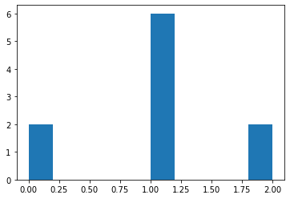
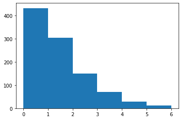
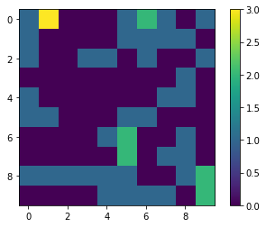
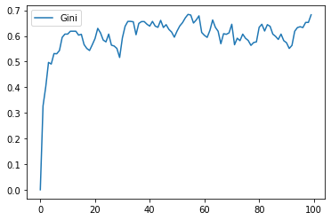
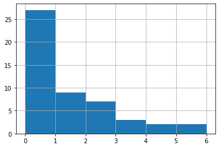
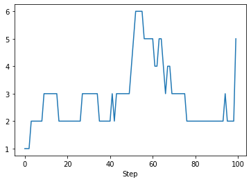
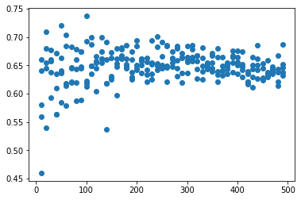

Introductory Tutorial
=====================

Tutorial Description
--------------------

`Mesa <https://github.com/projectmesa/mesa>`__ is a Python framework for
`agent-based
modeling <https://en.wikipedia.org/wiki/Agent-based_model>`__. Getting
started with Mesa is easy. In this tutorial, we will walk through
creating a simple model and progressively add functionality which will
illustrate Mesa’s core features.

**Note:** This tutorial is a work-in-progress. If you find any errors or
bugs, or just find something unclear or confusing, `let us
know <https://github.com/projectmesa/mesa/issues>`__!

The base for this tutorial is a very simple model of agents exchanging
money. Next, we add *space* to allow agents to move. Then, we’ll cover
two of Mesa’s analytic tools: the *data collector* and *batch runner*.
After that, we’ll add an *interactive visualization* which lets us watch
the model as it runs. Finally, we go over how to write your own
visualization module, for users who are comfortable with JavaScript.

You can also find all the code this tutorial describes in the
**examples/boltzmann_wealth_model** directory of the Mesa repository.

Sample Model Description
------------------------

The tutorial model is a very simple simulated agent-based economy, drawn
from econophysics and presenting a statistical mechanics approach to
wealth distribution [Dragulescu2002]. The rules of our tutorial model:

1. There are some number of agents.
2. All agents begin with 1 unit of money.
3. At every step of the model, an agent gives 1 unit of money (if they
   have it) to some other agent.

Despite its simplicity, this model yields results that are often
unexpected to those not familiar with it. For our purposes, it also
easily demonstrates Mesa’s core features.

Let’s get started.

Installation
~~~~~~~~~~~~

To start, install Mesa. We recommend doing this in a `virtual
environment <https://virtualenvwrapper.readthedocs.org/en/stable/>`__,
but make sure your environment is set up with Python 3. Mesa requires
Python3 and does not work in Python 2 environments.

To install Mesa, simply:

.. code:: bash

       $ pip install mesa

When you do that, it will install Mesa itself, as well as any
dependencies that aren’t in your setup yet. Additional dependencies
required by this tutorial can be found in the
**examples/boltzmann_wealth_model/requirements.txt** file, which can be
installed directly form the github repository by running:

.. code:: bash

       $ pip install -r https://raw.githubusercontent.com/projectmesa/mesa/main/examples/boltzmann_wealth_model/requirements.txt

| This will install the dependencies listed in the requirements.txt file
  which are:
| - jupyter (Ipython interactive notebook)
| - matplotlib (Python’s visualization library)
| - mesa (this ABM library – if not installed)
| - numpy (Python’s numerical python library)

Building a sample model
-----------------------

Once Mesa is installed, you can start building our model. You can write
models in two different ways:

1. Write the code in its own file with your favorite text editor, or
2. Write the model interactively in `Jupyter
   Notebook <http://jupyter.org/>`__ cells.

Either way, it’s good practice to put your model in its own folder –
especially if the project will end up consisting of multiple files (for
example, Python files for the model and the visualization, a Notebook
for analysis, and a Readme with some documentation and discussion).

Begin by creating a folder, and either launch a Notebook or create a new
Python source file. We will use the name ``money_model.py`` here.

Setting up the model
~~~~~~~~~~~~~~~~~~~~

To begin writing the model code, we start with two core classes: one for
the overall model, the other for the agents. The model class holds the
model-level attributes, manages the agents, and generally handles the
global level of our model. Each instantiation of the model class will be
a specific model run. Each model will contain multiple agents, all of
which are instantiations of the agent class. Both the model and agent
classes are child classes of Mesa’s generic ``Model`` and ``Agent``
classes. This is seen in the code with ``class MoneyModel(mesa.Model)``
or ``class MoneyAgent(mesa.Agent)``. If you want you can specifically
the class being imported by looking at the
`model <https://github.com/projectmesa/mesa/blob/main/mesa/model.py>`__
or
`agent <https://github.com/projectmesa/mesa/blob/main/mesa/agent.py>`__
code in the mesa repo.

Each agent has only one variable: how much wealth it currently has.
(Each agent will also have a unique identifier (i.e., a name), stored in
the ``unique_id`` variable. Giving each agent a unique id is a good
practice when doing agent-based modeling.)

There is only one model-level parameter: how many agents the model
contains. When a new model is started, we want it to populate itself
with the given number of agents.

The beginning of both classes looks like this:

.. code:: ipython3

    import mesa

    class MoneyAgent(mesa.Agent):
        """An agent with fixed initial wealth."""

        def __init__(self, unique_id, model):
            super().__init__(unique_id, model)
            self.wealth = 1

    class MoneyModel(mesa.Model):
        """A model with some number of agents."""

        def __init__(self, N):
            self.num_agents = N
            # Create agents
            for i in range(self.num_agents):
                a = MoneyAgent(i, self)

Adding the scheduler
~~~~~~~~~~~~~~~~~~~~

Time in most agent-based models moves in steps, sometimes also called
**ticks**. At each step of the model, one or more of the agents –
usually all of them – are activated and take their own step, changing
internally and/or interacting with one another or the environment.

The **scheduler** is a special model component which controls the order
in which agents are activated. For example, all the agents may activate
in the same order every step; their order might be shuffled; we may try
to simulate all the agents acting at the same time; and more. Mesa
offers a few different built-in scheduler classes, with a common
interface. That makes it easy to change the activation regime a given
model uses, and see whether it changes the model behavior. This may not
seem important, but scheduling patterns can have an impact on your
results [Comer2014].

For now, let’s use one of the simplest ones: ``RandomActivation``\ \*,
which activates all the agents once per step, in random order. Every
agent is expected to have a ``step`` method. The step method is the
action the agent takes when it is activated by the model schedule. We
add an agent to the schedule using the ``add`` method; when we call the
schedule’s ``step`` method, the model shuffles the order of the agents,
then activates and executes each agent’s ``step`` method.

\*Unlike ``mesa.model`` or ``mesa.agent``, ``mesa.time`` has multiple
classes (e.g. ``RandomActivation``, ``StagedActivation`` etc). To ensure
context, time is used in the import as evidenced below with
``mesa.time.Randomactivation``. You can see the different time classes
as
`mesa.time <https://github.com/projectmesa/mesa/blob/main/mesa/time.py>`__.

With that in mind, the model code with the scheduler added looks like
this:

.. code:: ipython3

    import mesa

    class MoneyAgent(mesa.Agent):
        """An agent with fixed initial wealth."""

        def __init__(self, unique_id, model):
            super().__init__(unique_id, model)
            self.wealth = 1

        def step(self):
            # The agent's step will go here.
            # For demonstration purposes we will print the agent's unique_id
            print("Hi, I am agent " + str(self.unique_id) + ".")

    class MoneyModel(mesa.Model):
        """A model with some number of agents."""

        def __init__(self, N):
            self.num_agents = N
            self.schedule = mesa.time.RandomActivation(self)
            # Create agents
            for i in range(self.num_agents):
                a = MoneyAgent(i, self)
                self.schedule.add(a)

        def step(self):
            """Advance the model by one step."""
            self.schedule.step()

At this point, we have a model which runs – it just doesn’t do anything.
You can see for yourself with a few easy lines. If you’ve been working
in an interactive session, you can create a model object directly.
Otherwise, you need to open an interactive session in the same directory
as your source code file, and import the classes. For example, if your
code is in ``money_model.py``:

.. code:: python

   from money_model import MoneyModel

Then create the model object, and run it for one step:

.. code:: ipython3

    empty_model = MoneyModel(10)
    empty_model.step()

.. parsed-literal::

    Hi, I am agent 6.
    Hi, I am agent 2.
    Hi, I am agent 1.
    Hi, I am agent 0.
    Hi, I am agent 4.
    Hi, I am agent 5.
    Hi, I am agent 3.
    Hi, I am agent 9.
    Hi, I am agent 8.
    Hi, I am agent 7.

Exercise
^^^^^^^^

Try modifying the code above to have every agent print out its
``wealth`` when it is activated. Run a few steps of the model to see how
the agent activation order is shuffled each step.

Agent Step
~~~~~~~~~~

Now we just need to have the agents do what we intend for them to do:
check their wealth, and if they have the money, give one unit of it away
to another random agent. To allow the agent to choose another agent at
random, we use the ``model.random`` random-number generator. This works
just like Python’s ``random`` module, but with a fixed seed set when the
model is instantiated, that can be used to replicate a specific model
run later.

To pick an agent at random, we need a list of all agents. Notice that
there isn’t such a list explicitly in the model. The scheduler, however,
does have an internal list of all the agents it is scheduled to
activate.

With that in mind, we rewrite the agent ``step`` method, like this:

.. code:: ipython3

    class MoneyAgent(mesa.Agent):
        """An agent with fixed initial wealth."""

        def __init__(self, unique_id, model):
            super().__init__(unique_id, model)
            self.wealth = 1

        def step(self):
            if self.wealth == 0:
                return
            other_agent = self.random.choice(self.model.schedule.agents)
            other_agent.wealth += 1
            self.wealth -= 1

Running your first model
~~~~~~~~~~~~~~~~~~~~~~~~

With that last piece in hand, it’s time for the first rudimentary run of
the model.

If you’ve written the code in its own file (``money_model.py`` or a
different name), launch an interpreter in the same directory as the file
(either the plain Python command-line interpreter, or the IPython
interpreter), or launch a Jupyter Notebook there. Then import the
classes you created. (If you wrote the code in a Notebook, obviously
this step isn’t necessary).

.. code:: python

   from money_model import *

Now let’s create a model with 10 agents, and run it for 10 steps.

.. code:: ipython3

    model = MoneyModel(10)
    for i in range(10):
        model.step()

Next, we need to get some data out of the model. Specifically, we want
to see the distribution of the agent’s wealth. We can get the wealth
values with list comprehension, and then use matplotlib (or another
graphics library) to visualize the data in a histogram.

If you are running from a text editor or IDE, you’ll also need to add
this line, to make the graph appear.

.. code:: python

   plt.show()

.. code:: ipython3

    # For a jupyter notebook add the following line:
    %matplotlib inline

    # The below is needed for both notebooks and scripts
    import matplotlib.pyplot as plt

    agent_wealth = [a.wealth for a in model.schedule.agents]
    plt.hist(agent_wealth)

.. parsed-literal::

    (array([2., 0., 0., 0., 0., 6., 0., 0., 0., 2.]),
     array([0. , 0.2, 0.4, 0.6, 0.8, 1. , 1.2, 1.4, 1.6, 1.8, 2. ]),
     <BarContainer object of 10 artists>)

You’ll should see something like the distribution above. Yours will
almost certainly look at least slightly different, since each run of the
model is random, after all.

To get a better idea of how a model behaves, we can create multiple
model runs and see the distribution that emerges from all of them. We
can do this with a nested for loop:

.. code:: ipython3

    all_wealth = []
    # This runs the model 100 times, each model executing 10 steps.
    for j in range(100):
        # Run the model
        model = MoneyModel(10)
        for i in range(10):
            model.step()

        # Store the results
        for agent in model.schedule.agents:
            all_wealth.append(agent.wealth)

    plt.hist(all_wealth, bins=range(max(all_wealth) + 1))

.. parsed-literal::

    (array([433., 304., 150.,  71.,  29.,  13.]),
     array([0, 1, 2, 3, 4, 5, 6]),
     <BarContainer object of 6 artists>)

This runs 100 instantiations of the model, and runs each for 10 steps.
(Notice that we set the histogram bins to be integers, since agents can
only have whole numbers of wealth). This distribution looks a lot
smoother. By running the model 100 times, we smooth out some of the
‘noise’ of randomness, and get to the model’s overall expected behavior.

This outcome might be surprising. Despite the fact that all agents, on
average, give and receive one unit of money every step, the model
converges to a state where most agents have a small amount of money and
a small number have a lot of money.

Adding space
~~~~~~~~~~~~

Many ABMs have a spatial element, with agents moving around and
interacting with nearby neighbors. Mesa currently supports two overall
kinds of spaces: grid, and continuous. Grids are divided into cells, and
agents can only be on a particular cell, like pieces on a chess board.
Continuous space, in contrast, allows agents to have any arbitrary
position. Both grids and continuous spaces are frequently
`toroidal <https://en.wikipedia.org/wiki/Toroidal_graph>`__, meaning
that the edges wrap around, with cells on the right edge connected to
those on the left edge, and the top to the bottom. This prevents some
cells having fewer neighbors than others, or agents being able to go off
the edge of the environment.

Let’s add a simple spatial element to our model by putting our agents on
a grid and make them walk around at random. Instead of giving their unit
of money to any random agent, they’ll give it to an agent on the same
cell.

Mesa has two main types of grids: ``SingleGrid`` and ``MultiGrid``\ \*.
``SingleGrid`` enforces at most one agent per cell; ``MultiGrid`` allows
multiple agents to be in the same cell. Since we want agents to be able
to share a cell, we use ``MultiGrid``.

\*However there are more types of space to include ``HexGrid``,
``NetworkGrid``, and the previously mentioned ``ContinuousSpace``.
Similar to ``mesa.time`` context is retained with
``mesa.space.[enter class]``. You can see the different classes as
`mesa.space <https://github.com/projectmesa/mesa/blob/main/mesa/space.py>`__

We instantiate a grid with width and height parameters, and a boolean as
to whether the grid is toroidal. Let’s make width and height model
parameters, in addition to the number of agents, and have the grid
always be toroidal. We can place agents on a grid with the grid’s
``place_agent`` method, which takes an agent and an (x, y) tuple of the
coordinates to place the agent.

.. code:: ipython3

    class MoneyModel(mesa.Model):
        """A model with some number of agents."""

        def __init__(self, N, width, height):
            self.num_agents = N
            self.grid = mesa.space.MultiGrid(width, height, True)
            self.schedule = mesa.time.RandomActivation(self)

            # Create agents
            for i in range(self.num_agents):
                a = MoneyAgent(i, self)
                self.schedule.add(a)

                # Add the agent to a random grid cell
                x = self.random.randrange(self.grid.width)
                y = self.random.randrange(self.grid.height)
                self.grid.place_agent(a, (x, y))

Under the hood, each agent’s position is stored in two ways: the agent
is contained in the grid in the cell it is currently in, and the agent
has a ``pos`` variable with an (x, y) coordinate tuple. The
``place_agent`` method adds the coordinate to the agent automatically.

Now we need to add to the agents’ behaviors, letting them move around
and only give money to other agents in the same cell.

First let’s handle movement, and have the agents move to a neighboring
cell. The grid object provides a ``move_agent`` method, which like you’d
imagine, moves an agent to a given cell. That still leaves us to get the
possible neighboring cells to move to. There are a couple ways to do
this. One is to use the current coordinates, and loop over all
coordinates +/- 1 away from it. For example:

.. code:: python

   neighbors = []
   x, y = self.pos
   for dx in [-1, 0, 1]:
       for dy in [-1, 0, 1]:
           neighbors.append((x+dx, y+dy))

But there’s an even simpler way, using the grid’s built-in
``get_neighborhood`` method, which returns all the neighbors of a given
cell. This method can get two types of cell neighborhoods:
`Moore <https://en.wikipedia.org/wiki/Moore_neighborhood>`__ (includes
all 8 surrounding squares), and `Von
Neumann <https://en.wikipedia.org/wiki/Von_Neumann_neighborhood>`__\ (only
up/down/left/right). It also needs an argument as to whether to include
the center cell itself as one of the neighbors.

With that in mind, the agent’s ``move`` method looks like this:

.. code:: python

   class MoneyAgent(mesa.Agent):
      #...
       def move(self):
           possible_steps = self.model.grid.get_neighborhood(
               self.pos,
               moore=True,
               include_center=False)
           new_position = self.random.choice(possible_steps)
           self.model.grid.move_agent(self, new_position)

Next, we need to get all the other agents present in a cell, and give
one of them some money. We can get the contents of one or more cells
using the grid’s ``get_cell_list_contents`` method, or by accessing a
cell directly. The method accepts a list of cell coordinate tuples, or a
single tuple if we only care about one cell.

.. code:: python

   class MoneyAgent(mesa.Agent):
       #...
       def give_money(self):
           cellmates = self.model.grid.get_cell_list_contents([self.pos])
           if len(cellmates) > 1:
               other = self.random.choice(cellmates)
               other.wealth += 1
               self.wealth -= 1

And with those two methods, the agent’s ``step`` method becomes:

.. code:: python

   class MoneyAgent(mesa.Agent):
       # ...
       def step(self):
           self.move()
           if self.wealth > 0:
               self.give_money()

Now, putting that all together should look like this:

.. code:: ipython3

    class MoneyAgent(mesa.Agent):
        """An agent with fixed initial wealth."""

        def __init__(self, unique_id, model):
            super().__init__(unique_id, model)
            self.wealth = 1

        def move(self):
            possible_steps = self.model.grid.get_neighborhood(
                self.pos, moore=True, include_center=False
            )
            new_position = self.random.choice(possible_steps)
            self.model.grid.move_agent(self, new_position)

        def give_money(self):
            cellmates = self.model.grid.get_cell_list_contents([self.pos])
            if len(cellmates) > 1:
                other_agent = self.random.choice(cellmates)
                other_agent.wealth += 1
                self.wealth -= 1

        def step(self):
            self.move()
            if self.wealth > 0:
                self.give_money()

    class MoneyModel(mesa.Model):
        """A model with some number of agents."""

        def __init__(self, N, width, height):
            self.num_agents = N
            self.grid = mesa.space.MultiGrid(width, height, True)
            self.schedule = mesa.time.RandomActivation(self)
            # Create agents
            for i in range(self.num_agents):
                a = MoneyAgent(i, self)
                self.schedule.add(a)
                # Add the agent to a random grid cell
                x = self.random.randrange(self.grid.width)
                y = self.random.randrange(self.grid.height)
                self.grid.place_agent(a, (x, y))

        def step(self):
            self.schedule.step()

Let’s create a model with 50 agents on a 10x10 grid, and run it for 20
steps.

.. code:: ipython3

    model = MoneyModel(50, 10, 10)
    for i in range(20):
        model.step()

Now let’s use matplotlib and numpy to visualize the number of agents
residing in each cell. To do that, we create a numpy array of the same
size as the grid, filled with zeros. Then we use the grid object’s
``coord_iter()`` feature, which lets us loop over every cell in the
grid, giving us each cell’s coordinates and contents in turn.

.. code:: ipython3

    import numpy as np

    agent_counts = np.zeros((model.grid.width, model.grid.height))
    for cell in model.grid.coord_iter():
        cell_content, x, y = cell
        agent_count = len(cell_content)
        agent_counts[x][y] = agent_count
    plt.imshow(agent_counts, interpolation="nearest")
    plt.colorbar()

    # If running from a text editor or IDE, remember you'll need the following:
    # plt.show()

.. parsed-literal::

    <matplotlib.colorbar.Colorbar at 0x2505197baf0>

Collecting Data
~~~~~~~~~~~~~~~

So far, at the end of every model run, we’ve had to go and write our own
code to get the data out of the model. This has two problems: it isn’t
very efficient, and it only gives us end results. If we wanted to know
the wealth of each agent at each step, we’d have to add that to the loop
of executing steps, and figure out some way to store the data.

Since one of the main goals of agent-based modeling is generating data
for analysis, Mesa provides a class which can handle data collection and
storage for us and make it easier to analyze.

The data collector stores three categories of data: model-level
variables, agent-level variables, and tables (which are a catch-all for
everything else). Model- and agent-level variables are added to the data
collector along with a function for collecting them. Model-level
collection functions take a model object as an input, while agent-level
collection functions take an agent object as an input. Both then return
a value computed from the model or each agent at their current state.
When the data collector’s ``collect`` method is called, with a model
object as its argument, it applies each model-level collection function
to the model, and stores the results in a dictionary, associating the
current value with the current step of the model. Similarly, the method
applies each agent-level collection function to each agent currently in
the schedule, associating the resulting value with the step of the
model, and the agent’s ``unique_id``.

Let’s add a DataCollector to the model with
`mesa.DataCollector <https://github.com/projectmesa/mesa/blob/main/mesa/datacollection.py>`__,
and collect two variables. At the agent level, we want to collect every
agent’s wealth at every step. At the model level, let’s measure the
model’s `Gini
Coefficient <https://en.wikipedia.org/wiki/Gini_coefficient>`__, a
measure of wealth inequality.

.. code:: ipython3

    def compute_gini(model):
        agent_wealths = [agent.wealth for agent in model.schedule.agents]
        x = sorted(agent_wealths)
        N = model.num_agents
        B = sum(xi * (N - i) for i, xi in enumerate(x)) / (N * sum(x))
        return 1 + (1 / N) - 2 * B

    class MoneyAgent(mesa.Agent):
        """An agent with fixed initial wealth."""

        def __init__(self, unique_id, model):
            super().__init__(unique_id, model)
            self.wealth = 1

        def move(self):
            possible_steps = self.model.grid.get_neighborhood(
                self.pos, moore=True, include_center=False
            )
            new_position = self.random.choice(possible_steps)
            self.model.grid.move_agent(self, new_position)

        def give_money(self):
            cellmates = self.model.grid.get_cell_list_contents([self.pos])
            if len(cellmates) > 1:
                other = self.random.choice(cellmates)
                other.wealth += 1
                self.wealth -= 1

        def step(self):
            self.move()
            if self.wealth > 0:
                self.give_money()

    class MoneyModel(mesa.Model):
        """A model with some number of agents."""

        def __init__(self, N, width, height):
            self.num_agents = N
            self.grid = mesa.space.MultiGrid(width, height, True)
            self.schedule = mesa.time.RandomActivation(self)

            # Create agents
            for i in range(self.num_agents):
                a = MoneyAgent(i, self)
                self.schedule.add(a)
                # Add the agent to a random grid cell
                x = self.random.randrange(self.grid.width)
                y = self.random.randrange(self.grid.height)
                self.grid.place_agent(a, (x, y))

            self.datacollector = mesa.DataCollector(
                model_reporters={"Gini": compute_gini}, agent_reporters={"Wealth": "wealth"}
            )

        def step(self):
            self.datacollector.collect(self)
            self.schedule.step()

At every step of the model, the datacollector will collect and store the
model-level current Gini coefficient, as well as each agent’s wealth,
associating each with the current step.

We run the model just as we did above. Now is when an interactive
session, especially via a Notebook, comes in handy: the DataCollector
can export the data its collected as a pandas\* DataFrame, for easy
interactive analysis.

\*If you are new to Python, please be aware that pandas is already
installed as a dependency of Mesa and that
`pandas <https://pandas.pydata.org/docs/>`__ is a “fast, powerful,
flexible and easy to use open source data analysis and manipulation
tool”. pandas is great resource to help analyze the data collected in
your models

.. code:: ipython3

    model = MoneyModel(50, 10, 10)
    for i in range(100):
        model.step()

To get the series of Gini coefficients as a pandas DataFrame:

.. code:: ipython3

    gini = model.datacollector.get_model_vars_dataframe()
    gini.plot()

.. parsed-literal::

    <AxesSubplot:>

Similarly, we can get the agent-wealth data:

.. code:: ipython3

    agent_wealth = model.datacollector.get_agent_vars_dataframe()
    agent_wealth.head()

.. raw:: html

    

    
    <table border="1" class="dataframe">
      <thead>
        <tr style="text-align: right;">
          <th></th>
          <th></th>
          <th>Wealth</th>
        </tr>
        <tr>
          <th>Step</th>
          <th>AgentID</th>
          <th></th>
        </tr>
      </thead>
      <tbody>
        <tr>
          <th rowspan="5" valign="top">0</th>
          <th>0</th>
          <td>1</td>
        </tr>
        <tr>
          <th>1</th>
          <td>1</td>
        </tr>
        <tr>
          <th>2</th>
          <td>1</td>
        </tr>
        <tr>
          <th>3</th>
          <td>1</td>
        </tr>
        <tr>
          <th>4</th>
          <td>1</td>
        </tr>
      </tbody>
    </table>
    

You’ll see that the DataFrame’s index is pairings of model step and
agent ID. You can analyze it the way you would any other DataFrame. For
example, to get a histogram of agent wealth at the model’s end:

.. code:: ipython3

    end_wealth = agent_wealth.xs(99, level="Step")["Wealth"]
    end_wealth.hist(bins=range(agent_wealth.Wealth.max() + 1))

.. parsed-literal::

    <AxesSubplot:>

Or to plot the wealth of a given agent (in this example, agent 14):

.. code:: ipython3

    one_agent_wealth = agent_wealth.xs(14, level="AgentID")
    one_agent_wealth.Wealth.plot()

.. parsed-literal::

    <AxesSubplot:xlabel='Step'>

You can also use pandas to export the data to a CSV (comma separated
value), which can be opened by any common spreadsheet application or
opened by pandas.

If you do not specify a file path, the file will be saved in the local
directory. After you run the code below you will see two files appear
(*model_data.csv* and *agent_data.csv*)

.. code:: ipython3

    # save the model data (stored in the pandas gini object) to CSV
    gini.to_csv("model_data.csv")

    # save the agent data (stored in the pandas agent_wealth object) to CSV
    agent_wealth.to_csv("agent_data.csv")

Batch Run
~~~~~~~~~

Like we mentioned above, you usually won’t run a model only once, but
multiple times, with fixed parameters to find the overall distributions
the model generates, and with varying parameters to analyze how they
drive the model’s outputs and behaviors. Instead of needing to write
nested for-loops for each model, Mesa provides a `batch_run <https://github.com/projectmesa/mesa/blob/main/mesa/batchrunner.py>`__
function which automates it for you.

The batch runner also requires an additional variable ``self.running``
for the MoneyModel class. This variable enables conditional shut off of
the model once a condition is met. In this example it will be set as
True indefinitely.

.. code:: ipython3

    def compute_gini(model):
        agent_wealths = [agent.wealth for agent in model.schedule.agents]
        x = sorted(agent_wealths)
        N = model.num_agents
        B = sum(xi * (N - i) for i, xi in enumerate(x)) / (N * sum(x))
        return 1 + (1 / N) - 2 * B

    class MoneyModel(mesa.Model):
        """A model with some number of agents."""

        def __init__(self, N, width, height):
            self.num_agents = N
            self.grid = mesa.space.MultiGrid(width, height, True)
            self.schedule = mesa.time.RandomActivation(self)
            self.running = True

            # Create agents
            for i in range(self.num_agents):
                a = MoneyAgent(i, self)
                self.schedule.add(a)
                # Add the agent to a random grid cell
                x = self.random.randrange(self.grid.width)
                y = self.random.randrange(self.grid.height)
                self.grid.place_agent(a, (x, y))

            self.datacollector = mesa.DataCollector(
                model_reporters={"Gini": compute_gini}, agent_reporters={"Wealth": "wealth"}
            )

        def step(self):
            self.datacollector.collect(self)
            self.schedule.step()

We call ``batch_run`` with the following arguments:

-  ``model_cls`` The model class that is used for the batch run.

-  ``parameters`` A dictionary containing all the parameters of the
   model class and desired values to use for the batch run as key-value
   pairs. Each value can either be fixed (
   e.g. ``{"height": 10, "width": 10}``) or an iterable
   (e.g. ``{"N": range(10, 500, 10)}``). ``batch_run`` will then
   generate all possible parameter combinations based on this dictionary
   and run the model ``iterations`` times for each combination.

-  ``number_processes`` If not specified, defaults to 1. Set it to
   ``None`` to use all the available processors. Note: Multiprocessing
   does make debugging challenging. If your parameter sweeps are
   resulting in unexpected errors set ``number_processes = 1``.

-  ``iterations`` The number of iterations to run each parameter
   combination for. Optional. If not specified, defaults to 1.

-  ``data_collection_period`` The length of the period (number of steps)
   after which the model and agent reporters collect data. Optional. If
   not specified, defaults to -1, i.e. only at the end of each episode.

-  ``max_steps`` The maximum number of time steps after which the model
   halts. An episode does either end when ``self.running`` of the model
   class is set to ``False`` or when
   ``model.schedule.steps == max_steps`` is reached. Optional. If not
   specified, defaults to 1000.

-  ``display_progress`` Display the batch run progress. Optional. If not
   specified, defaults to ``True``.

In the following example, we hold the height and width fixed, and vary
the number of agents. We tell the batch runner to run 5 instantiations
of the model with each number of agents, and to run each for 100 steps.

We want to keep track of

1. the Gini coefficient value and
2. the individual agent’s wealth development.

Since for the latter changes at each time step might be interesting, we
set ``data_collection_period = 1``.

Note: The total number of runs is 245 (= 49 different populations \* 5
iterations per population). However, the resulting list of dictionaries
will be of length 6186250 (= 250 average agents per population \* 49
different populations \* 5 iterations per population \* 101 steps per
iteration).

**Note for Windows OS users:** If you are running this tutorial in
Jupyter, make sure that you set ``number_processes = 1`` (single
process). If ``number_processes`` is greater than 1, it is less
straightforward to set up. You can read `Mesa’s collection of useful
snippets <https://github.com/projectmesa/mesa/blob/main/docs/useful-snippets/snippets.rst>`__,
in ‘Using multi-process ``batch_run`` on Windows’ section for how to do
it.

.. code:: ipython3

    params = {"width": 10, "height": 10, "N": range(10, 500, 10)}

    results = mesa.batch_run(
        MoneyModel,
        parameters=params,
        iterations=5,
        max_steps=100,
        number_processes=1,
        data_collection_period=1,
        display_progress=True,
    )

.. parsed-literal::

    245it [00:34,  7.02it/s]

To further analyze the return of the ``batch_run`` function, we convert
the list of dictionaries to a Pandas DataFrame and print its keys.

.. code:: ipython3

    import pandas as pd

    results_df = pd.DataFrame(results)
    print(results_df.keys())

.. parsed-literal::

    Index(['RunId', 'iteration', 'Step', 'width', 'height', 'N', 'Gini', 'AgentID',
           'Wealth'],
          dtype='object')

First, we want to take a closer look at how the Gini coefficient at the
end of each episode changes as we increase the size of the population.
For this, we filter our results to only contain the data of one agent
(the Gini coefficient will be the same for the entire population at any
time) at the 100th step of each episode and then scatter-plot the values
for the Gini coefficient over the the number of agents. Notice there are
five values for each population size since we set ``iterations=5`` when
calling the batch run.

.. code:: ipython3

    results_filtered = results_df[(results_df.AgentID == 0) & (results_df.Step == 100)]
    N_values = results_filtered.N.values
    gini_values = results_filtered.Gini.values
    plt.scatter(N_values, gini_values)

.. parsed-literal::

    <matplotlib.collections.PathCollection at 0x250bd5b41c0>

Second, we want to display the agent’s wealth at each time step of one
specific episode. To do this, we again filter our large data frame, this
time with a fixed number of agents and only for a specific iteration of
that population. To print the results, we convert the filtered data
frame to a string specifying the desired columns to print.

Pandas has built-in functions to convert to a lot of different data
formats. For example, to display as a table in a Jupyter Notebook, we
can use the ``to_html()`` function which takes the same arguments as
``to_string()`` (see commented lines).

.. code:: ipython3

    # First, we filter the results
    one_episode_wealth = results_df[(results_df.N == 10) & (results_df.iteration == 2)]
    # Then, print the columns of interest of the filtered data frame
    print(
        one_episode_wealth.to_string(
            index=False, columns=["Step", "AgentID", "Wealth"], max_rows=25
        )
    )
    # For a prettier display we can also convert the data frame to html, uncomment to test in a Jupyter Notebook
    # from IPython.display import display, HTML
    # display(HTML(one_episode_wealth.to_html(index=False, columns=['Step', 'AgentID', 'Wealth'], max_rows=25)))

.. parsed-literal::

     Step  AgentID  Wealth
        0        0       1
        0        1       1
        0        2       1
        0        3       1
        0        4       1
        0        5       1
        0        6       1
        0        7       1
        0        8       1
        0        9       1
        1        0       2
        1        1       1
    ...        ...     ...
       99        8       4
       99        9       1
      100        0       0
      100        1       0
      100        2       1
      100        3       0
      100        4       1
      100        5       1
      100        6       0
      100        7       2
      100        8       4
      100        9       1

Lastly, we want to take a look at the development of the Gini
coefficient over the course of one iteration. Filtering and printing
looks almost the same as above, only this time we choose a different
episode.

.. code:: ipython3

    results_one_episode = results_df[
        (results_df.N == 10) & (results_df.iteration == 1) & (results_df.AgentID == 0)
    ]
    print(results_one_episode.to_string(index=False, columns=["Step", "Gini"], max_rows=25))

.. parsed-literal::

     Step  Gini
        0  0.00
        1  0.18
        2  0.18
        3  0.18
        4  0.18
        5  0.32
        6  0.32
        7  0.32
        8  0.42
        9  0.42
       10  0.42
       11  0.42
    ...     ...
       89  0.66
       90  0.66
       91  0.66
       92  0.66
       93  0.56
       94  0.56
       95  0.56
       96  0.56
       97  0.56
       98  0.56
       99  0.56
      100  0.56

Happy Modeling!
~~~~~~~~~~~~~~~

This document is a work in progress. If you see any errors, exclusions
or have any problems please contact
`us <https://github.com/projectmesa/mesa/issues>`__.

``virtual environment``:
http://docs.python-guide.org/en/latest/dev/virtualenvs/

[Comer2014] Comer, Kenneth W. “Who Goes First? An Examination of the
Impact of Activation on Outcome Behavior in AgentBased Models.” George
Mason University, 2014.
http://mars.gmu.edu/bitstream/handle/1920/9070/Comer_gmu_0883E_10539.pdf

[Dragulescu2002] Drăgulescu, Adrian A., and Victor M. Yakovenko.
“Statistical Mechanics of Money, Income, and Wealth: A Short Survey.”
arXiv Preprint Cond-mat/0211175, 2002.
http://arxiv.org/abs/cond-mat/0211175.
