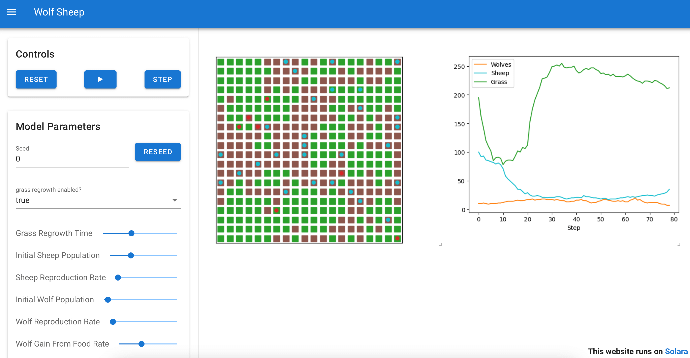

# Summary
Mesa is an open-source Python framework for agent-based modeling (ABM) that enables researchers to create, analyze and visualize agent-based simulations. Mesa 3.0 represents a major evolution of the framework, introducing improvements in agent management, visualization capabilities, and overall architecture while maintaining Python's simplicity and accessibility. This paper presents the key innovations in Mesa 3.0 and discusses how they advance the state of agent-based modeling in Python.

# Statement of need
Agent-based modeling is a powerful approach for studying complex systems across many disciplines, from economics and sociology to ecology and epidemiology. As simulations grow more sophisticated, researchers need frameworks that can efficiently handle complex agents and environments while remaining approachable and flexible. While established platforms like NetLogo and MASON exist, there is a clear need for a modern, Python-based framework that integrates with the scientific Python ecosystem and provides robust ABM capabilities.

Mesa addresses this need by offering a modular, extensible framework that leverages Python's strengths in scientific computing and data analysis. Mesa 3.0 builds on this foundation with enhanced features for managing agents, collecting data, and visualizing results, making it easier for researchers to create and analyze complex simulations.

# Key features and improvements
## Agent management and scheduling
Mesa 3.0 introduces a new agent management system centered around the AgentSet class, which provides intuitive ways to organize and manipulate collections of agents. Key capabilities include:

- Automatic agent tracking and unique ID assignment
- Flexible agent filtering and grouping operations
- Efficient collective operations through methods like `shuffle_do()` and `select()`
- Built-in support for agent types and hierarchies

```python
# Select agents meeting specific criteria and calculate an aggegrate value
wealthy_agents = model.agents.select(lambda a: a.wealth > 1000)
avg_wealth = wealthy_agents.agg("wealth", func=np.mean)
```

This system also replaces the previous scheduler-based approach, offering more explicit control over agent activation patterns while reducing complexity.

```python
# Apply methods to groups of agents
model.agents.shuffle_do("step")  # Random activation
model.agents.groupby("species").do("reproduce")  # Group-specific behaviors
```

## Environmental modeling
Mesa 3.0 enhances spatial modeling through PropertyLayers, which enable efficient representation and manipulation of environmental properties:

```python
grid = SingleGrid(width, height, torus=True)
elevation = PropertyLayer("elevation", width, height)
grid.add_property_layer(elevation)

# Efficient bulk operations on properties
grid.properties["elevation"].modify_cells(np.multiply, 2)
```

These modules facilitate the modeling of complex environments, including grids and networks, where spatial properties influence agent behavior.

## Visualization
Mesa 3.0 introduces SolaraViz, a modern visualization system that provides interactive browser-based model exploration:

```python
visualization = SolaraViz(
    model,
    components=[space_component, lineplot_component],
    model_params=model_params,
    name="Wolf Sheep",
    simulator=simulator,
)
```



## Data collection and analysis
The DataCollector component has been expanded to support collecting different metrics for different agent types:

```python
datacollector = DataCollector(
    model_reporters={"population": lambda m: len(m.agents)},
    agenttype_reporters={
        Predator: {"kills": "kills_count"},
        Prey: {"distance_fled": "flight_distance"}
    }
)
```

This enables more nuanced analysis of heterogeneous agent populations while maintaining integration with the pandas ecosystem for data analysis.

## Experimental features
Mesa 3.0 and 3.1 introduces several experimental features for advanced modeling scenarios:

- PropertyLayer: An NumPy ndarray-based system for adding and managing layers of spatially-distributed properties (like elevation, temperature, or resources) to grid spaces, enabling bulk operations and fast selection of cells based on their properties, with  integration into both the current Grid spaces and the new Cell spaces.
- Cell Space: A cell-centric approach to spatial modeling where cells are active entities with properties and behaviors rather than just containers for agents, enabling more sophisticated environmental modeling through cells that can have their own properties and interact with agents.
- Discrete Event Scheduling: A system for scheduling events at arbitrary (non-integer) time points with priority-based ordering, supporting both pure discrete event simulation and hybrid approaches that combine agent-based modeling with event scheduling.
- Mesa Signals (Observables): A reactive programming capability that enables tracking changes to properties and state in models, allowing components to observe and automatically react to changes in other components' state through a system of signals and computed values.

# Implementation and architecture
Mesa 3.0 is implemented in pure Python and requires Python 3.10 or higher. The framework follows a modular design with clear separation between:

1. Core modeling components (agents, spaces, model management)
2. Data collection and analysis tools
3. Visualization systems

This architecture allows users to use only the components they need while enabling easy extension and customization. The framework integrates well with the scientific Python ecosystem, including NumPy, pandas, and Matplotlib.

# Applications and impact
Mesa has been used across diverse fields including:

- Epidemiology and public health modeling
- Economic and market simulations
- Social network analysis
- Urban planning and transportation
- Ecological modeling

The improvements in Mesa 3.0 make it particularly suitable for:

- Models with multiple different Agent types or high heterogenity
- Models requiring sophisticated spatial interactions and environments
- Interactive exploration of parameter spaces
- Teaching and learning agent-based modeling

# Community and Ecosystem
Mesa has grown into a complete ecosystem for agent-based modeling, with extensions including:

- [Mesa-Geo](https://github.com/projectmesa/mesa-geo) for geospatial modeling
- [Mesa-Frames](https://github.com/projectmesa/mesa-frames) for high-performance simulations
- A rich collection of example models and tutorials

The framework is developed by six maintainers (the authors) and an active community with over 130 contributors.

# Conclusions
Mesa 3.0 represents a significant advance in Python-based agent-based modeling, offering improved agent management, visualization, and data collection capabilities while maintaining an accessible, modular architecture. These improvements make Mesa an increasingly powerful tool for researchers across disciplines who need to create and analyze agent-based models.
